# Telemetry Collection & Emulation Policy (AP-14)

Our effort to keep up with an undocumented vendor API will be a constant "battle". FranklinWH routinely mutates their backend JSON schemas to accommodate new features (e.g., V2 APIs), often unconditionally dropping or renaming critical metrics. 

To proactively defend against undocumented breakages, `franklinwh-cloud` utilizes a combination of **Active Emulation** and **Passive Canary Telemetry**.

## Why We Emulate the Mobile App

The FranklinWH Cloud API natively utilizes the `softwareversion` HTTP Request Header (e.g., `APP2.4.1`) to determine *which* JSON payload schema to return to the client.

If a client does not send a `softwareversion` header, or sends a legacy version, the backend silently degrades the response to a legacy "V1" schema structure, stripping out newer capabilities like explicit Smart Circuit modeling, dedicated `getHotSpotInfo/v2` properties, or granular TOU schedules. 

We emulate the official mobile application to ensure our Python integration receives the highest-fidelity, feature-complete API responses available.

## How and When We Emulate

1. **Client Spoofing Parameter**: The Python `Client` and `PasswordAuth` constructors natively accept an `emulate_app_version` dynamic variable (defaulting to the latest verified working mobile app frame, such as `APP2.4.1`).
2. **Dynamic Injection**: This string is actively injected into the HTTP headers of all outgoing `GET` and `POST` calls to force the backend into serving V2 schemas. 
3. **Honest Fingerprinting**: To distinguish the library from malicious actors while still receiving V2 responses, the client MUST honestly identify its framework via `optsource: 3` (Third-Party) and `optdevicename: python`.

## The Canary in the Code (Passive Telemetry)

Because FranklinWH silently governs its API evolutions via the `softwareversion` header, the backend actually uses the header as a handshake to quietly notify the mobile app when it needs to update (bypassing the App Stores).

We exploit this handshake using a "Canary" mechanism to detect schema drift automatically:
- During `PasswordAuth._login()`, our library natively intercepts the JSON response.
- If the server explicitly overrides our `emulate_app_version` by echoing a newer `softwareVersion` string (flagging a forced backend update), or if a live payload diverges from our `canary_baseline_version`, our internal handler flags the discrepancy.
- This true backend string is stored entirely in memory inside `client.metrics._latest_backend_software_version`.
- At fixed UTC intervals, external integrations (like Home Assistant) can passively query this metric to coordinate when the library schemas formally need patching.

> [!WARNING]
> We never obfuscate, encrypt, or hide this `emulate_app_version` parameter. Security by obscurity inside an open-source Python library is entirely ineffective since anyone can read the source code. Transparency forces stability; open hardcoding allows downstream integrators to easily manipulate the emulation version if they discover a new schema endpoint before we do.

## Software Version Handshake (State Diagram)

```mermaid
sequenceDiagram
    participant CLI as franklinwh-cloud
    participant HA as Integrator / User
    participant FWH as FranklinWH Cloud Backend
    
    rect rgb(30, 30, 30)
    Note over CLI,FWH: 1. Anonymous / Legacy Request
    CLI->>FWH: POST /login (No softwareversion header)
    FWH-->>CLI: Return Legacy JSON (V1 Schemas, Missing V2 Keys)
    end
    
    rect rgb(30, 40, 50)
    Note over CLI,FWH: 2. Active Emulation Handshake (Typical)
    HA->>CLI: init Client(emulate_app_version="APP2.4.1")
    CLI->>FWH: POST /login (Header: softwareversion=APP2.4.1)
    FWH-->>CLI: Return Enriched JSON (V2 Schemas)
    end
    
    rect rgb(50, 30, 30)
    Note over CLI,FWH: 3. The Canary Trip (Drift Detection)
    CLI->>FWH: POST /login (Header: softwareversion=APP2.4.1)
    FWH-->>CLI: Force Update! {"softwareVersion": "APP2.9.0"}
    CLI->>CLI: Intercept drift, store natively in in-memory Metrics
    HA->>CLI: Periodic UTC query client.metrics
    HA->>HA: Alert user: "Backend API logic shifted!"
    end
```

