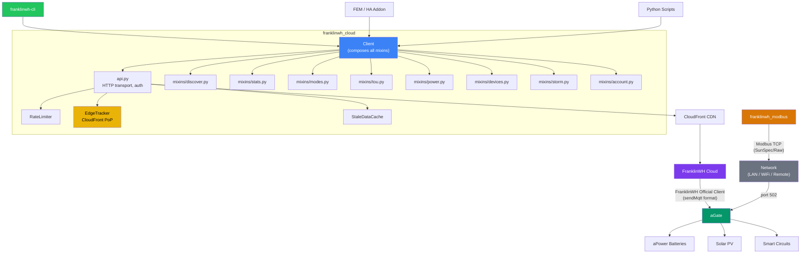

# FranklinWH Cloud Client


A Python client library for interacting with FranklinWH energy storage systems via the cloud API.

> 📦 **Package**: `franklinwh-cloud-client` (install from source or GitHub — not yet on PyPI) | **import**: `from franklinwh_cloud import Client`

> 📊 **Fork of [richo/franklinwh-python](https://github.com/richo/franklinwh-python)** — see [FORK_ANALYSIS.md](FORK_ANALYSIS.md) for a detailed comparison of additions (60+ API methods, 45+ sensor fields, TOU scheduling, power control, and more).

> 🔒 **API Citizenship**: See [API_CLIENT_GUIDE.md](API_CLIENT_GUIDE.md) for rate limiting strategies, client identity headers, and how to prepare for authentication changes.

## ✨ Features

- **Authentication**: Automatic token management and refresh, homeowner + installer account types
- **Real-time Data**: Battery status, solar production, grid usage, home loads
- **Mode Control**: Switch between operating modes (Time-of-Use, Self-Consumption, Emergency Backup)
- **TOU Schedules**: Manage Time-of-Use scheduling with multi-season, weekday/weekend support
- **Device Info**: Gateway details, network status, device inventory, BMS cell-level data
- **Performance Monitoring**: API call metrics, response timing (min/avg/max), error rates, and CloudFront edge tracking
- **CloudFront Edge Tracking**: Automatic PoP location monitoring, failover detection, cache hit rates, and distribution ID tracking
- **Client Identity**: Honest identification headers for responsible API citizenship
- **Rate Limiting**: Opt-in client-side throttling with per-minute/hour/daily budgets
- **Stale Data Cache**: Per-endpoint TTL caching for graceful degradation when the cloud is slow or unavailable
- **Modular Architecture**: Domain-specific mixins (stats, modes, TOU, storm, power, devices, account)
- **CLI Tool**: Subcommand-based CLI with `fetch` for arbitrary endpoint access, debug tracing, JSON output

## 🔧 Technical Highlights

| Capability | Implementation |
|------------|----------------|
| **HTTP/2** | All API calls use `httpx` with `http2=True` — multiplexed requests, header compression, persistent connections |
| **CloudFront Monitoring** | Tracks PoP edge location, cache hit rate, distribution IDs, and failover transitions in real-time |
| **Configurable Base URL** | `Client(fetcher, gw, url_base=...)` — ready for FranklinWH DNS migration (`energy.` → `api.`) |
| **Dual Account Types** | `LOGIN_TYPE_USER` (0) and `LOGIN_TYPE_INSTALLER` (1) constants for homeowner and installer login |
| **Stale-While-Revalidate** | Per-endpoint TTL cache returns last-known-good data during API outages |
| **Modbus Mode Constants** | Bidirectional `CLOUD_TO_MODBUS_MODE` / `MODBUS_TO_CLOUD_MODE` mapping for Modbus TCP integration |
| **70+ API Endpoints** | Comprehensive coverage across TOU scheduling, power control, BMS, storm, smart circuits, compliance |

## 📦 Installation

### From wheel (recommended for downstream projects like FEM)

```bash
pip install dist/franklinwh_cloud_client-0.2.0-py3-none-any.whl
```

### From source (editable, for development)

```bash
git clone https://github.com/david2069/franklinwh-cloud.git
cd franklinwh-cloud
python3 -m venv venv
source venv/bin/activate
pip install -e .
```

### With test dependencies

```bash
pip install -e ".[test]"
```

### From GitHub (direct)

```bash
# Latest (tracks main branch)
pip install git+https://github.com/david2069/franklinwh-cloud.git@main

# Pinned release (recommended for production / Docker)
pip install git+https://github.com/david2069/franklinwh-cloud.git@v0.2.0
```

## ⚙️ Configuration

Create `franklinwh.ini` with your credentials:

```ini
[energy.franklinwh.com]
email = your.email@example.com
password = your_password

[gateways.enabled]
serialno = YOUR_GATEWAY_SERIAL
```

**Security Note**: The `.ini` file is in `.gitignore` to protect your credentials.

Alternatively, set environment variables:
```bash
export FRANKLIN_USERNAME="your.email@example.com"
export FRANKLIN_PASSWORD="your_password"
export FRANKLIN_GATEWAY="YOUR_GATEWAY_SERIAL"
```

## 🚀 Quick Start

### Python API

```python
import asyncio
from franklinwh import Client, TokenFetcher

async def main():
    fetcher = TokenFetcher("email@example.com", "password")
    client = Client(fetcher, "YOUR_GATEWAY_SERIAL")

    # Get real-time stats
    stats = await client.get_stats()
    print(f"Battery: {stats.current.battery_soc}%")
    print(f"Solar: {stats.current.solar_production} kW")
    print(f"Mode: {stats.current.work_mode_desc}")

    # API metrics (automatic)
    metrics = client.get_metrics()
    print(f"API calls: {metrics['total_api_calls']}, avg {metrics['avg_response_time_s']:.3f}s")

asyncio.run(main())
```

### CLI Tool

```bash
# System overview — power, SOC, batteries, weather, grid, metrics
franklinwh-cli status

# Device discovery — 3 verbosity tiers
franklinwh-cli discover          # High-level: site, aGate, flags, state
franklinwh-cli discover -v       # Verbose: + firmware, warranty, relays, accessories
franklinwh-cli discover -vv      # Pedantic: + full firmware, NEM, PTO date
franklinwh-cli discover --json   # Full JSON export

# Operating mode
franklinwh-cli mode
franklinwh-cli mode --set tou --soc 20

# TOU schedule inspection
franklinwh-cli tou --dispatch

# Direct API passthrough (33 methods available)
franklinwh-cli raw help
franklinwh-cli raw get_power_info
franklinwh-cli raw get_bms_info AP_SERIAL_NUMBER

# API metrics
franklinwh-cli metrics

# Real-time battery monitor (auto-refresh dashboard)
franklinwh-cli monitor              # full dashboard, 30s refresh, Ctrl+C to exit
franklinwh-cli monitor -i 10        # refresh every 10 seconds
franklinwh-cli monitor -d 5         # run for 5 minutes then stop
franklinwh-cli monitor --compact    # single-line mode (no screen clearing)
franklinwh-cli monitor --json       # JSON stream per interval
```

**Output modes:**
```bash
franklinwh-cli status --json    # JSON output
franklinwh-cli status --no-color  # disable ANSI colours
```

**Debug & tracing:**
```bash
franklinwh-cli status -v          # API call summaries
franklinwh-cli status -vv         # + request/response headers
franklinwh-cli status -vvv        # + full raw JSON payloads
franklinwh-cli tou --trace tou    # only TOU mixin debug (46 log points!)
franklinwh-cli status --trace all # everything
franklinwh-cli status --api-trace # per-call timing
franklinwh-cli status -vv --log-file debug.log
```

## 🏗️ Architecture



```
franklinwh_cloud/
├── client.py            # Client class (inherits all mixins)
├── models.py            # Stats, Current, Totals, GridStatus dataclasses
├── api.py               # HTTP transport, auth, session management
├── exceptions.py        # Custom exception hierarchy
├── metrics.py           # ClientMetrics — API call instrumentation
├── discovery.py         # DeviceSnapshot dataclass
├── const/               # Operating modes, TOU, device constants
│   ├── modes.py, tou.py, devices.py, device_catalog.json
├── mixins/              # Domain-specific API method groups (8 modules)
│   ├── discover.py      # client.discover() — 3-tier device survey
│   ├── stats.py         # get_stats, get_runtime_data, get_power_by_day
│   ├── modes.py         # get_mode, set_mode, get_mode_info
│   ├── tou.py           # TOU schedule CRUD + dispatch details
│   ├── storm.py         # weather, storm hedge settings
│   ├── power.py         # grid status, PCS settings, power control
│   ├── devices.py       # device info, BMS, composite info
│   └── account.py       # site info, notifications, alarms, warranty
├── cli.py               # CLI entry point
├── cli_output.py        # Terminal rendering + colour utilities
└── cli_commands/        # CLI subcommand modules
    ├── status.py        # Power flow, SOC, mode, weather, grid
    ├── discover.py      # Device discovery — 3 tiers, system readiness
    ├── monitor.py       # Real-time dashboard (full/compact/JSON)
    ├── metrics.py       # API probe + CloudFront edge data
    ├── bms.py           # Battery Management System inspection
    ├── diag.py          # System diagnostics report
    ├── tou.py           # TOU schedule with dispatch details
    ├── mode.py          # Operating mode get/set
    └── raw.py           # Direct API method calls
```

## 📖 Documentation

| Document | Description |
|----------|-------------|
| [API_CLIENT_GUIDE.md](API_CLIENT_GUIDE.md) | Rate limiting, CloudFront edge tracking, metrics, monitor usage |
| [FORK_ANALYSIS.md](FORK_ANALYSIS.md) | Detailed comparison with upstream `richo/franklinwh-python` |
| [HISTORY.md](HISTORY.md) | Project timeline from fork to independence |
| [UPSTREAM_STRATEGY.md](UPSTREAM_STRATEGY.md) | Contributing back to upstream — the trust ladder |
| [CHANGELOG.md](CHANGELOG.md) | Version history and release notes |
| [CONTRIBUTING.md](CONTRIBUTING.md) | Development setup, code standards, PR process |
| [ISSUES.md](ISSUES.md) | How to report bugs and request features |

## 🧪 Testing

```bash
# Unit tests only (no API credentials needed)
pytest -m "not live" -q

# Live API tests (requires franklinwh.ini or env vars)
pytest -m live -v

# All tests
pytest -v

# Record results for traceability (AP-11)
./tests/run_and_record.sh CLI-refactor
cat tests/results/test_history.log
```

**Current coverage**: 253 tests across all 8 domains

## 📚 API Reference

### Client Methods

| Domain | Key Methods |
|--------|-------------|
| **Discovery** | `discover(tier=1)` → `DeviceSnapshot` — site, aGate, batteries, flags, accessories, warranty |
| **Stats** | `get_stats()`, `get_runtime_data()`, `get_power_by_day(date)`, `get_power_details(type, date)` |
| **Modes** | `get_mode()`, `set_mode(mode, soc)`, `get_mode_info()` |
| **TOU** | `get_tou_info(type)`, `set_tou(schedule)`, `get_gateway_tou_list()`, `get_tou_dispatch_detail()` |
| **Tariff** | `get_utility_companies()`, `get_tariff_list()`, `get_tariff_detail()`, `apply_tariff_template()` |
| **Storm** | `get_weather()`, `get_storm_settings()`, `get_storm_list()` |
| **Power** | `get_grid_status()`, `get_power_control_settings()`, `get_power_info()` |
| **Devices** | `get_device_info()`, `get_bms_info(serial)`, `get_device_composite_info()` |
| **Account** | `siteinfo()`, `get_warranty_info()`, `get_alarm_codes_list()`, `get_notification_settings()` |
| **Metrics** | `get_metrics()` → `{total_api_calls, avg_response_time_s, calls_by_method, errors, ...}` |

### Data Structures

```python
stats.current.battery_soc          # Battery State of Charge (%)
stats.current.solar_production     # Solar production (kW)
stats.current.grid_use             # Grid usage (kW, negative = export)
stats.current.home_load            # Home consumption (kW)
stats.current.work_mode_desc       # Operating mode name
stats.current.grid_status          # GridStatus enum (NORMAL/DOWN/OFF)
stats.totals.solar                 # Daily solar production (kWh)
stats.totals.grid_import           # Daily grid import (kWh)
stats.totals.home_use              # Daily home consumption (kWh)
```

## 🗺️ Roadmap

### Installer Account Support (CLI-only, read-only)

The FranklinWH Cloud API supports **installer accounts** — these are privileged accounts used by solar installers to manage fleets of customer aGate gateways. The login endpoint (`appUserOrInstallerLogin`) supports both account types via a `type` parameter: `0` = app user, `1` = installer.

**Already implemented:**
- `LOGIN_TYPE_USER = 0` and `LOGIN_TYPE_INSTALLER = 1` constants
- `login_type` parameter on `TokenFetcher`, `login()`, and `_login()`
- Configurable `url_base` on `Client` for future DNS changes

**Planned scope:**
- CLI `--installer` flag to authenticate as an installer
- `discover` command to list all customer gateways in the installer's fleet
- `status` command with `--gateway SN` to view any customer's system
- **Read-only only** — no write operations (mode changes, TOU updates) via installer CLI
- Per-gateway selection required (no fleet-wide operations)

**Usage:**
```python
from franklinwh_cloud.client import TokenFetcher, LOGIN_TYPE_INSTALLER

# Installer login
fetcher = TokenFetcher("installer@company.com", "password", login_type=LOGIN_TYPE_INSTALLER)
client = Client(fetcher, "CUSTOMER_GATEWAY_SN")
info = await client.siteinfo()  # returns installerId, userTypes, roles, etc.
```

> ⚠️ Installer accounts can access and modify multiple customer sites. This library intentionally **limits installer support to read-only CLI operations** as a matter of responsible API citizenship. Developers who fork this library assume their own responsibility for write operations.

## 🤝 Contributing

See [CONTRIBUTING.md](CONTRIBUTING.md) for development setup, code standards,
API citizenship requirements, and pull request process.

See [ISSUES.md](ISSUES.md) for how to report bugs and request features.

## 📝 License

MIT License with Additional Terms — see [LICENSE](LICENSE) for details.

The Additional Terms address the specific risks of interacting with
undocumented energy equipment APIs. **You must read and understand the
LICENSE before using this software.**

## 🙏 Acknowledgments

- **[FranklinWH](https://www.franklinwh.com)** - For innovative energy storage systems
- **[richo](https://github.com/richo/franklinwh-python)** - Original library foundation
- This project was developed with AI assistance (Claude, Gemini)

## ⚖️ Disclaimer

> **UNOFFICIAL SOFTWARE — NOT AFFILIATED WITH FRANKLINWH**
>
> By using this software, you confirm that you have read and understood the
> [LICENSE](LICENSE) and its Additional Terms.
>
> This software is provided **AS-IS**, without warranty of any kind, express or implied,
> including but not limited to the warranties of merchantability, fitness for a particular
> purpose, and non-infringement. Use entirely at your own risk.
>
> This library interacts with FranklinWH's undocumented cloud API, which may change,
> break, or become unavailable without notice. The authors accept no liability for
> service interruptions, data loss, equipment damage, or any other consequences
> arising from the use of this software.
>
> **MIT License** — see [LICENSE](LICENSE) for details.

This disclaimer is also logged once at startup by the library for audit trail purposes.
