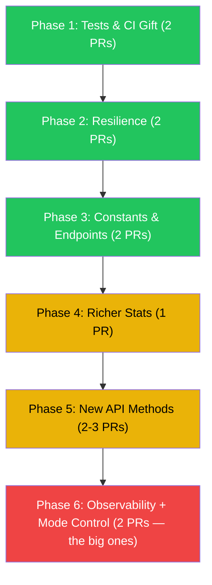

# Upstream PR Strategy: franklinwh-cloud-client → richo/franklinwh-python

**Goal**: Contribute our best work back to richo's upstream repo in a way that builds trust, demonstrates quality, and makes acceptance easy.

**Updated**: 2026-03-17 — Corrected Phase 1 after auditing richo's actual codebase.

---

## Strategy: The Trust Ladder

Upstream a fork this diverged in one giant PR = instant rejection. Instead, we climb a **trust ladder** — small, undeniable contributions first, then progressively larger features.



---

## What Actually Exists in richo's Code (Audited 2026-03-17)

| Finding | Lines | Notes |
|---------|-------|-------|
| 3 `TODO(richo)` comments | 488, 554, 637 | Timeouts, switch state flux, wrong get_mode values |
| `assert res["code"] == 200` | 723 | Will crash in production — should be raised exception |
| 8× unguarded `["result"]` | multiple | No `.get()` fallbacks — will KeyError on unexpected responses |
| `get_mode()` self-documented as wrong | 637 | "These are actually wrong but I can't obviously find where to get the correct values" |
| **Zero tests** | — | No `tests/` directory exists |
| **Zero CI** | — | No GitHub Actions, no test automation |
| **No typo bugs** | — | ~~`gatewayOd`, `_pos_get`~~ were in our fork's added code, NOT richo's |

---

## Phase 1: Gift — Tests & CI 🟢 (Week 1)

**Goal**: Give, don't take. Offer infrastructure richo doesn't have yet.

### PR 1.1: Add unit test framework + initial tests
- **New files**: `tests/`, `conftest.py`, `test_get_stats.py`, `test_token_fetcher.py`
- **What**: 10-15 unit tests covering `get_stats`, `TokenFetcher`, `_build_payload`, `GridStatus`
- **Dependencies**: `respx` for HTTP mocking (add to `pyproject.toml` `[test]` extra)
- **Key message**: "No behaviour changes — just tests for existing code"
- **Acceptance odds**: 🟢 **High** — pure gift, no code changes

### PR 1.2: Add GitHub Actions CI
- **New file**: `.github/workflows/test.yml`
- **What**: Run tests on push/PR to main
- **Acceptance odds**: 🟢 **High** — standard practice

> [!TIP]
> These PRs give richo testing infrastructure he can use to validate jkt628's 4 pending PRs too. We're helping the whole project, not just ourselves.

---

## Phase 2: Resilience 🟢 (Week 2)

**Goal**: Address richo's own TODOs and fragile patterns.

### PR 2.1: Replace `assert` with proper exception
- **File**: `client.py` line 723
- **Change**: `assert res["code"] == 200` → raise `FranklinWHAPIError` with message
- **Why**: `assert` is stripped by `python -O`, silently passing bad responses
- **Impact**: 1 line change + new exception class
- **Test**: Include test for non-200 response handling
- **Acceptance odds**: 🟢 **High** — objectively better

### PR 2.2: Add timeout handling (addresses `TODO(richo)` at lines 488, 554)
- **Files**: `client.py` `_post`, `_get`
- **Change**: Add `timeout=` parameter with sensible defaults, catch `httpx.TimeoutException`
- **Why**: richo wrote the TODO himself — he knows it's needed
- **Test**: Include timeout test
- **Acceptance odds**: 🟢 **High** — fixes his own TODO

---

## Phase 3: Constants & Endpoints 🟢 (Week 3)

### PR 3.1: Extract `endpoints.py` — URL constants
- Replace 10+ hardcoded URL strings with named constants
- No behaviour change, readability improvement

### PR 3.2: Extract `const/modes.py` — mode maps
- Move `MODE_MAP`, `MODE_*` to dedicated module
- No behaviour change

**Acceptance odds**: 🟢 **High** — pure refactoring

---

## Phase 4: Richer Stats 🟡 (Week 4)

### PR 4.1: Add fields to `Current` and `Totals`
- Add 15+ fields already available in the API response that richo discards
- `work_mode`, network signal, relay states, grid voltage, per-battery data
- **Backward compatible**: all new fields have defaults
- **Key argument**: "The data is already fetched — we're just not throwing it away"
- **Test**: Extended `test_get_stats.py`
- **Acceptance odds**: 🟡 **Medium-High**

---

## Phase 5: New API Methods 🟡 (Weeks 5-6)

All **read-only**, purely additive — can't break anything.

### PR 5.1: Device & Account methods
`siteinfo()`, `get_device_info()`, `get_warranty_info()`, `get_weather()`

### PR 5.2: Power & Storm methods
`get_power_info()`, `get_power_control_settings()`, `get_storm_list()`

### PR 5.3: Notification & Alarm methods
`get_notifications()`, `get_alarm_codes_list()`, `get_gateway_alarm()`

**Acceptance odds**: 🟡 **Medium-High** — no write operations, pure additions

---

## Phase 6: The Big Ones 🔴 (Week 7+)

### PR 6.1: API metrics + CloudFront edge tracking
- New `metrics.py` — opt-in via `Client(..., track_metrics=True)`
- Zero overhead when disabled
- Addresses the observability gap
- **Acceptance odds**: 🟠 **Medium**

### PR 6.2: Enhanced `set_mode` + `get_mode`
- Fixes richo's `TODO(richo)` at line 637 ("These are actually wrong")
- Full validation, backup-forever, duration, next-mode transitions
- Addresses HA PR #41 (community has been requesting since Nov 2025)
- **Acceptance odds**: 🔴 **Uncertain** — large change, but solves real user problems

---

## What Stays Fork-Only

| Module | Why |
|--------|-----|
| CLI (`cli.py`, `cli_commands/`) | Not useful for HA integration users |
| Package rename (`franklinwh_cloud`) | Richo's stays `franklinwh` |
| `StaleDataCache` | Opinionated for our FEM use case |
| `DISCLAIMER` constant | Our legal needs |
| Installer account support | Future fork-only feature |
| Client identity headers | Fork-only API citizenship |

---

## Relationship Management

### Engaging richo
1. **Lead with gifts** (tests, CI) not demands
2. **Reference his TODOs** — "You noted this needed work, here's a solution"
3. **Phrase as building on his foundation**, never as fixing his mistakes
4. **Offer review on jkt628's PRs** — show we're community members, not just contributors

### Engaging jkt628 (4 open PRs, most active contributor)
- Our metrics work complements their `time_cached` PR #23
- Review their PRs to build relationship
- Collaborate rather than compete

### PR Description Template
```markdown
## What
[One sentence]

## Why
[Problem + link to upstream issue/TODO if applicable]

## Testing
- Added X unit tests
- All existing tests pass

## Backward Compatibility
[Why this doesn't break existing code]
```

---

## Timeline

| Week | Phase | PRs | Trust Level |
|------|-------|:---:|:-----------:|
| 1 | Tests + CI gift | 2 | Building |
| 2 | Resilience (assert, timeouts) | 2 | Establishing |
| 3 | Constants extraction | 2 | Growing |
| 4 | Richer stats | 1 | Solid |
| 5-6 | New API methods | 2-3 | Strong |
| 7+ | Observability + Mode control | 2 | Proven |

> [!CAUTION]
> **Don't rush.** Wait for each phase to be reviewed/merged before submitting the next. ~1 PR per week is ideal for a solo maintainer.
