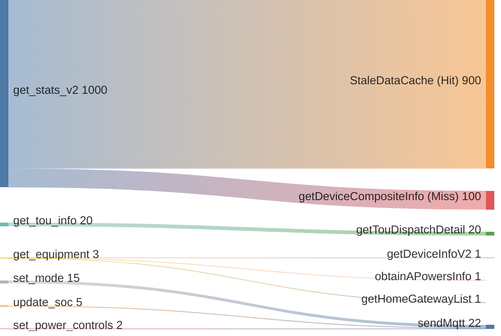
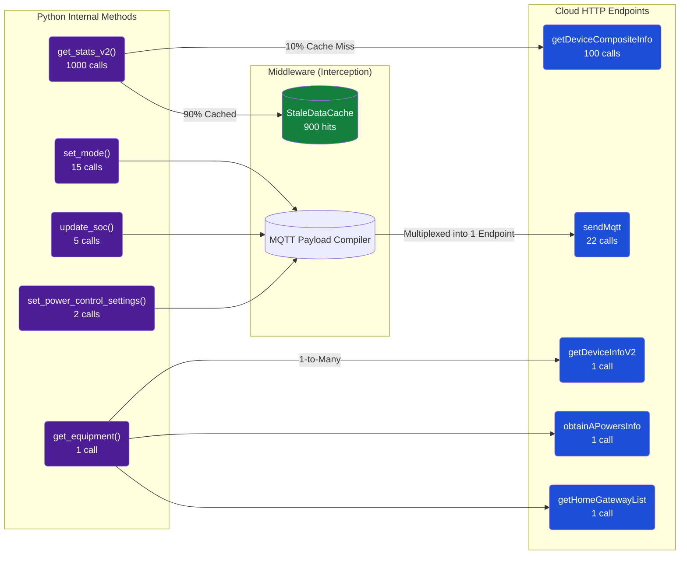

# Local Telemetry & API Metrics Mapping

The `franklinwh-cloud` library internally tracks extensive telemetry about API usage. Due to the architecture of the library, there is a fundamental split between **Python Method** hit-counts and **Cloud Endpoint** HTTP requests.

This document serves as the architectural explanation and visualization strategy for these metrics.

## The Mismatch: Methods vs. Endpoints

When consuming `client.get_metrics()`, you receive two primary payload dictionaries:
1. `calls_by_method`: Execution counts of internal Python wrapper functions (e.g., `get_stats_v2`, `update_soc`).
2. `calls_by_endpoint`: Raw outbound HTTP network hits against the FranklinWH Cloud API endpoints (e.g., `getDeviceCompositeInfo`, `sendMqtt`).

These totals **will inherently mismatch** for three specific reasons:

### 1. The Caching Multiplier (High Call Volume, Low Network IO)
Local polling daemons (like the MQTT Publisher) run on fast loops, calling Python methods (like `get_stats`) every few seconds. Because the library intercepts these calls with the `StaleDataCache`, >90% of those Python calls return instantly from memory. Thus, thousands of `get_stats` calls may resolve to only a handful of actual HTTP requests locally.

### 2. Funneling / Multiplexing (Commands)
Multiple distinct Python control methods (`set_mode()`, `update_soc()`, `set_power_control_settings()`) compile generic JSON payloads that are all funneled through the exact same Cloud API remote endpoint (`sendMqtt`). 

### 3. 1-to-Many Fan-out (Complex Data)
A single Python wrapper method such as `get_equipment()` executes multiple sequential HTTP calls behind the scenes to stitch together Gateway, Battery, and Panel data.

---

## Visualization Strategy

### The Sankey Diagram
A Sankey chart is the ideal frontend visualization for this mismatch. It perfectly models both the convergence (funneling) and the evaporation (cache interception) of telemetry data.

### Flowchart Counterpart (With Hover Tooltips)

Using D3, ECharts, or Mermaid, you can bind rich tooltips to the chart nodes. In Mermaid, `click` directives allow hovertext injections without navigating away.

---

## Front-End UI / Dashboard Proposal

To deploy this in an integrator UI properly without confusing the end-user:

### 1. Dual-View or Sankey Dashboard
Instead of relying on a toggle dropdown that fundamentally changes the meaning of the `Total API Calls` metric at the top of the dashboard, deploy a **Sankey Graphic** component directly above the data tables.
*   **Left-side nodes:** `data.methods` sizes.
*   **Central node:** The Cache / Router layer.
*   **Right-side nodes:** `data.endpoints` bound sizes.

### 2. Interactive Table Filtering
Use the visual Sankey as the interactive filter for the tables below it.
*   Clicking an internal method node filters the table to show what outbound endpoints it generated.
*   Clicking an endpoint node reverse-filters the table to show which internal Python calls spawned that traffic.

### 3. Implementing Tooltips via SVG Bindings
If implementing this via `D3.js` or `Chart.js` rather than raw Mermaid:
*   Inject the hovertext directly from the JSON payload.
*   When hovering over the `StaleDataCache` routing edge, display: `Saved 900 outbound API requests (90% reduction)`.
*   When hovering over `sendMqtt`, display: `Originating calls: 15x set_mode, 5x update_soc`.
