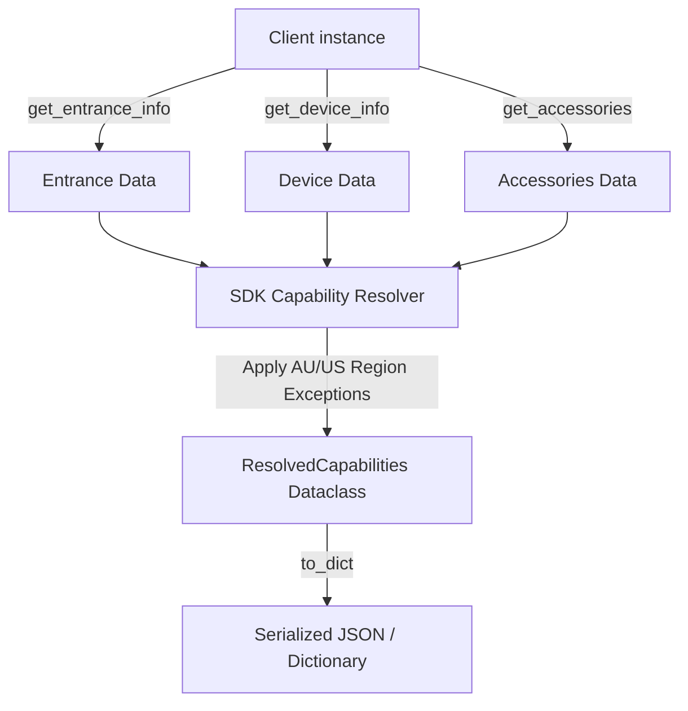

# SDK Spec: Programmatic Capability Resolution

This design document specifies the capability resolution architecture within the `franklinwh-cloud` Python SDK. Downstream consumers (such as the `franklinwh-ha-integrator` Home Assistant integration, custom scripts, and the CLI) require a single, unified method to query the active capabilities of a gateway, rather than parsing multiple raw API endpoints and resolving regional hardware exceptions individually.

---

## 1. SDK Capability Resolution Architecture

The `franklinwh-cloud` client library will expose a single programmatic helper to resolve and freeze system capabilities based on live Cloud API responses.



### Location in SDK
- **Data Model:** `franklinwh_cloud/models.py` (add `ResolvedCapabilities` dataclass).
- **Resolver Function:** `franklinwh_cloud/discovery.py` (implement capability compilation).
- **Client Interface:** `franklinwh_cloud/client.py` (add `get_resolved_capabilities()` async method).

---

## 2. Capability Schema & Rule Resolver

The SDK resolves a frozen `ResolvedCapabilities` snapshot by combining three endpoints:
1. `get_entrance_info()` (grid limits, solar port config, tariff configurations)
2. `get_device_info()` (battery counts, v2l configuration, system hardware version)
3. `get_accessories(option=0)` (smart circuit lists and generators)

### Python Dataclass Definition (`franklinwh_cloud/models.py`)
```python
@dataclass(frozen=True)
class ResolvedCapabilities:
    # Identity
    country_id: int            # 1=CN, 2=US, 3=AU (site location)
    agate_generation: int      # 1=Gen 1, 2=Gen 2 (derived from sysHdVersion)
    gateway_id: str            # Gateway serial number
    
    # Solar Capabilities
    solar_installed: bool      # Sourced from solarFlag / pv1Port / pv2Port
    pv1_installed: bool
    pv2_installed: bool
    has_mppt: bool             # Sourced from mpptEnFlag (aPower S support)
    has_apbox: bool            # Sourced from apbox20Num > 0
    
    # Accessories
    has_smart_circuits: bool   # Sourced from get_accessories() type=4
    circuit_count: int         # Sourced from country_id rules (3 for US, 2 for AU)
    has_generator: bool        # Sourced from get_accessories() type=3 / genEn
    has_v2l: bool              # Sourced from v2lModeEnable
    
    # Grid
    grid_connected: bool       # Sourced from gridFlag / offGridFlag
    three_phase: bool          # Sourced from isThreePhaseInstall
    
    # Pricing & VPP
    vpp_eligible: bool         # Sourced from checkUserVppEligibility()
    tariff_configured: bool    # Sourced from tariffSettingFlag
    
    def to_dict(self) -> dict:
        """Convert capabilities to a plain dictionary for API/CLI serialization."""
        ...
```

---

## 3. SDK Regional Exception Rules

To ensure correct status reporting across different international markets, the SDK resolver enforces regional overrides:

### Rule 1: Australian V2L Lock
*   **Condition:** `country_id == 3` (Australia).
*   **Logic:** Force `has_v2l = False` regardless of whether the API returns `v2lModeEnable = 1`.
*   **Rationale:** V2L functionality is physically disabled/uncertified on Australian hardware profiles.

### Rule 2: Australian Smart Circuit Channels
*   **Condition:** `country_id == 3`.
*   **Logic:** Limit `circuit_count = 2`.
*   **Rationale:** Australian smart circuit enclosures only support 2 control channels (Channel 3 controls are ignored or hidden).

### Rule 3: Off-Grid Installation Mode
*   **Condition:** `grid_connected == False` (islanded or off-grid configuration).
*   **Logic:** Disable `vpp_eligible = False`.
*   **Rationale:** VPP/DR events require a utility grid connection.

---

## 4. Downstream Integration Interface

Downstream clients (like the Home Assistant integration) can query this resolved state programmatically:

```python
# Programmatic SDK Usage Example
client = Client(auth, "10060006AXXXXXXXXX")
capabilities = await client.get_resolved_capabilities()

if capabilities.solar_installed:
    # Register solar sensors and energy telemetry entities
    ...
    
if capabilities.has_smart_circuits:
    # Register circuit relay controls up to capabilities.circuit_count channels
    ...
```

---

## 5. Test & Verification Plan

### Automated SDK Tests (`tests/test_capabilities.py`)
Write Python test cases asserting resolution correctness:
1.  **Test US Configuration:**
    *   Mock `countryId = 2`, `v2lModeEnable = 1`, and 3 smart circuits.
    *   Assert `has_v2l == True` and `circuit_count == 3`.
2.  **Test Australian Configuration Quirks:**
    *   Mock `countryId = 3`, `v2lModeEnable = 1`, and 3 smart circuits.
    *   Assert `has_v2l == False` (overridden) and `circuit_count == 2` (overridden).
3.  **Test Off-Grid Configuration:**
    *   Mock `gridFlag = 0`.
    *   Assert `vpp_eligible == False`.
