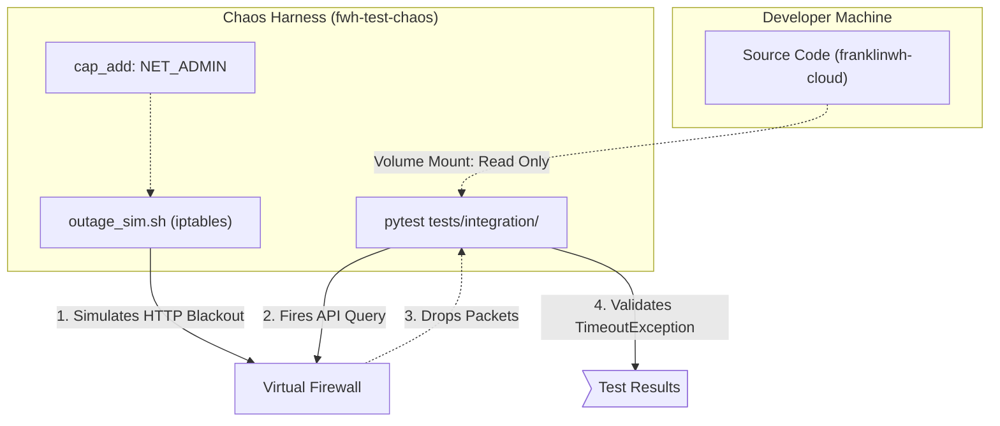

# QA Stress-Test Framework (The Chaos Harness)

## 1. Executive Summary

### Why
To permanently eradicate low-level routing regressions and exception-handling crashes (e.g., the `NameError: timeout_s` incident). Standard Python unit tests implicitly assume perfect 0ms network latency, masking catastrophic syntax errors lurking inside `TimeoutException` blocks. 

### What
A dedicated, containerized "Chaos Harness." It mounts the `franklinwh-cloud` codebase inside a dedicated Linux Docker construct explicitly granted `NET_ADMIN` capabilities. A specialized `outage_sim.sh` script executes `iptables` rules to mimic real-world network blackouts while PyTest is actively querying the cloud API.

## 2. Logistics

* **When**: The Chaos Harness MUST be executed immediately following any modification to the `client.py` HTTP transport layer, authentication loops, or API endpoint targets. It must pass 100% of defined scenarios before upstream code `push` is authorized.
* **Where**: Locally deployed within a rigid `tests/docker/` environment configuration. It never runs inside generic pipelines or unprivileged CI environments. 

## 3. Dedicated Environment Architecture (How)

To ensure this environment can be completely destroyed and rebuilt structurally on-demand at any time, it is built exactly as follows:

1. **`tests/docker/Dockerfile`**: A hardened Python container explicitly injecting `gcc` and `iptables` during the build phase natively.
2. **`tests/docker/docker-compose.yml`**: Exposes the local `/dev/franklinwh-cloud` module into the harness via read-only volume mounts (`:ro`) and forcefully elevates network privileges via the `cap_add: - NET_ADMIN` declaration.

## 4. Roles & Required Metrics

### Who Uses It?
All autonomous Agents and human integrators attempting to refactor networking or retry logic.

### Required Metrics
If the harness is executed, the process is only considered a "Pass" if the following metrics are validated in the resulting diagnostic dump:
1. **Network Drop Count**: The kernel must log exactly > 5 blocked outbound packets matching the target FWH Cloud API subnet to prove the simulated timeout was triggered.
2. **Traceback Nullification**: The python execution exit-code must explicitly be `0`. A crash yielding a `SyntaxError` or `NameError` explicitly fails the integration.
3. **Graceful Exception Match**: The CLI/Library must gracefully emit a logged `FranklinWHTimeoutError` or retry back-off. 

## 5. Architectural Guardrails (Defeating the "Optimistic Agent")

Because autonomous coding agents are statistically predisposed to "Optimistic Verification" (i.e. rewriting the test script or mocking an API to easily achieve a fake "Pass" instead of fixing the underlying code), strict mechanical guardrails are instantiated to protect the integrity of the chaos execution:

| Risk Profile | Protective Guardrail |
|--------------|----------------------|
| **Agent overwrites the testing script** | The test scripts are mounted into the Chaos container as `Read-Only` (`:ro`). The container physically cannot modify the test logic during the run. |
| **Agent disables the firewall during the test** | The `run_and_record.sh` wrapper script explicitly pings `fhp-api.franklinwh.com` during the `pytest` initialization block. If the ping succeeds, the test suite is aborted instantly with a `Chaos Environment Not Armed` error. The agent is forced to deploy the `iptables` rules. |
| **Agent attempts to mock the HTTP interface** | Tests asserting resiliency MUST employ `httpx.Client()` natively pointing to the physical `https://fhp-api.franklinwh.com` domain. Validations involving `responses` or `unittest.mock` within the Chaos suite are programmatically blocked by a bespoke PyTest fixture enforcing live DNS translation. |

---

> **CRITICAL ENFORCEMENT**: Any agent requesting user-approval to merge a branch touching `franklinwh_cloud/client.py` MUST append the literal text output array from the Chaos Harness proving the `iptables` firewall successfully blocked the real-world connection. 
