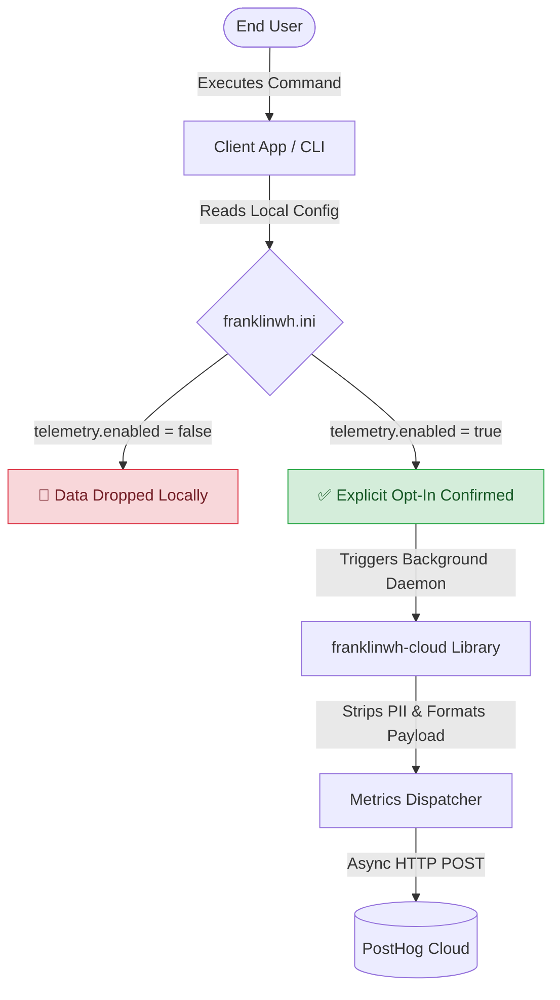

# Telemetry & Privacy Policy

The `franklinwh-cloud` library and CLI prioritize user privacy. Because this integration handles critical smart home appliances and cloud credentials, strict privacy boundaries are mathematically enforced. 

This document outlines an end-to-end explanation of our telemetry philosophy, strictly bounded by a "Need to Know" basis.

## 1. Why it Exists & What is Collected

Telemetry exists to help maintainers understand how the library is utilized in the wild, enabling us to deprecate unused endpoints safely, focus on highly trafficked features, and diagnose widespread API timeouts.

### Passive Installation Tracking (Scarf)
We use [Scarf](https://scarf.sh/) to passively track generic package downloads (e.g., PyPI installations or Home Assistant pulls).
- **Base Metrics Collected**: Package version, OS family, and abstract geographic region.
- **Privacy Model**: IPs are aggressively anonymized *before* hitting our dashboard to maintain GDPR/CCPA compliance.
- **Example Use Case**: Knowing that 90% of downloads are targeting Linux architectures allows us to prioritize testing on Linux over Windows.
- **Example Data Link**: [Scarf Privacy & Data Examples](https://about.scarf.sh/privacy)

### Active Feature Usage (PostHog)
For deeper operational usage, we provide an **OPTIONAL** integration with [PostHog](https://posthog.com/). **This is never used without explicit user consent under any circumstances.**
- **Base Metrics Collected**: The specific Python command invoked (e.g., `discover`, `tou --set`), execution latency, and success/failure flags. We only collect what is needed—nothing more, nothing less.
- **Privacy Model**: 100% Opt-In. If enabled, the terminal is assigned an anonymous UUID (e.g., `c7b2...`). We never extract emails, passwords, gateway serials, or battery configurations.
- **Example Use Case**: Determining if users genuinely utilize the `--extended` table views or identifying which operating modes fail most frequently.
- **Example Data Link**: [PostHog Event Tracking Examples](https://posthog.com/docs/getting-started/send-events)

## 2. Who Will Benefit
The telemetry ecosystem is carefully designed to benefit three distinct parties:
1. **Users** (Homeowners / End-Consumers)
2. **Developers** (Authors of downstream tools, like Home Assistant overlays)
3. **Maintainers** (The core contributors of `franklinwh-cloud`)

## 3. How Will Each Party Benefit
* **Users**: Experience significantly faster bug resolutions. If an API endpoint changes upstream and causes 500 timeouts, telemetry allows the maintainers to push a hotfix before the user even has to file a GitHub issue.
* **Developers**: Gain visibility into which features of their custom wrapper are actually being leveraged by their specific user base, allowing them to optimize performance.
* **Maintainers**: Avoid flying blind. Maintainers can confidently refactor components, permanently knowing exactly which CLI commands or endpoints are critical and which rely on legacy logic.

## 4. Where Can You See the Metrics Collected?
Currently, raw telemetry is securely ingested into the library's private Scarf and PostHog organizational dashboards accessible only by the core architectural maintainers. 

However, because the `dispatch_cli_event` pipeline is strictly open-sourced, **downstream Developers** are actively encouraged to fork the PostHog API keys to route their specific user-metrics into their own personal PostHog dashboards for their own applications.

---

## 5. End-to-End Architecture Flow

The following Mermaid diagram outlines exactly how the strict opt-in framework protects user data before it ever touches an external network.



---

## Developer Guide: Implementing PostHog Telemetry

If you are building a custom CLI wrapper (e.g., `franklinwh_cli.py`) or a Home Assistant component using `franklinwh-cloud`, you **MUST** properly comply with all consent requirements. **You must formally request opt-in consent from your users via a UI toggle or explicitly written configuration file.**

### Step 1: Register for PostHog (Bring Your Own Key)
We **do not** register or host a central PostHog organizational dashboard for external users. If you want to use this tracking pipeline to monitor your own tool's usage, you must register your own free account:

1. Go to [https://posthog.com/signup](https://posthog.com/signup) and create a free account.
2. Once logged in, navigate to **Project Settings**.
3. Locate your **Project API Key** (it will begin with `phc_...`).
4. Inject that key securely into your `.env` or `franklinwh.ini` file.

### Step 2: Configure `franklinwh.ini`
Your users (or yourself) must explicitly opt-in by creating a `[telemetry]` block that stores your new API key:

```ini
[telemetry]
enabled = true
uuid = my-anonymous-user-1234
api_key = phc_your_actual_project_id_here
```

**Plain English translation:** When your code calls our tracking function, it doesn't wait around for the internet to connect or the data to send. It simply hands the data off to a background worker and instantly moves on. This guarantees your app never slows down, freezes, or lags just because it's trying to send a metric.

*(Technical detail: The dispatcher uses a highly isolated zero-dependency **synchronous daemon thread** running built-in `urllib` to ensure your main script/CLI tears down instantly without waiting for HTTP connections, mathematically guaranteeing zero application lag.)*

### The `dispatch_cli_event` Method Explained

Before implementing the library hook, you should understand exactly what this import does beneath the hood:
* **Why**: To non-intrusively log that a specific feature of your interface (e.g., custom Modbus polling or Home Assistant action) was successfully executed. This allows you to objectively measure adoption rates of your own custom components.
* **How**: By spinning up a completely detached Python background daemon thread (`urllib`) that fires an asynchronous HTTP `POST`. This guarantees 0ms of latency added to your script's exit sequence.
* **What**: It constructs a tiny, strictly formed JSON payload containing only: the `command_executed` string, an executed timestamp, execution latency (ms), a success boolean, and your user's localized `execution_uuid`.
* **Where**: It transmits directly to `https://app.posthog.com/capture/` over HTTPS TLS.
* **Viewability**: The metric acts as a raw "Event" in PostHog. You can log into your PostHog dashboard, open the "Events" tab, and immediately view a live bar-graph grouping by Command Name to show aggregated daily frequencies and average latencies.

---

## 6. PostHog Extraction & Interpretation Guide

When `dispatch_cli_event` fires, it transmits exactly one event to PostHog named `franklinwh_cloud_execution`. 

### The JSON Payload (`What` is collected)
If a user runs your custom `franklinwh-cli status` wrapper, PostHog receives this exact dictionary under the event's "Properties" tab:
```json
{
  "event": "franklinwh_cloud_execution",
  "distinct_id": "c7b2... (user UUID)",
  "properties": {
    "command": "status",
    "execution_latency_ms": 412,
    "success": true
  }
}
```

### How to Build Dashboards & Interpret the Metrics

Once your users start generating these events, you can log into PostHog to extract the data using **Insights**. Here are the three mandatory metrics you should monitor and how to interpret them:

**1. API Degradation Tracking (Latency)**
* **How to build**: Create a *Trends* Insight. Set Series to `franklinwh_cloud_execution`, click the Y-axis metric and change it to `Average Property Value`, then select `execution_latency_ms`. Group the chart by the `command` property.
* **Interpretation**: If your "Average Latency" chart historically hovers around 400ms, but suddenly spikes to 9,000ms+ globally across all your users, the upstream FranklinWH Cloud API server is experiencing a major outage. You don't need to guess if the lag is your code's fault or theirs.

**2. Error Rate Spikes (Success = false)**
* **How to build**: Create a *Trends* Insight. Filter the events where `success` equals `false`.
* **Interpretation**: If this number suddenly spikes, FranklinWH likely changed a JSON schema upstream, breaking your parser, or the user's authentication token pool was completely invalidated. 

**3. Feature Adoption Rates**
* **How to build**: Create a *Pie Chart* Insight. Group by the `command` property.
* **Interpretation**: If you spend 20 hours building a massive new `dispatch` feature, but this pie chart reveals that 98% of your users only ever execute the `status` command, you instantly know where to focus your future developmental resources. 

### Worked Example

Here is exactly how you connect the tracking pipeline into your own script's `main()` lifecycle:

```python
import configparser
import os
import sys

# 1. Import your main client components
from franklinwh_cloud.client import Client

# 2. Import the isolated tracking daemon
from franklinwh_cloud.telemetry import dispatch_cli_event

def main():
    # Example: you parse the incoming CLI command (e.g. 'status', 'tou --set')
    command_executed = sys.argv[1] if len(sys.argv) > 1 else "unknown"

    # 3. Read the user's explicit Opt-In consent config
    telemetry_enabled = False
    telemetry_uuid = "anonymous"
    
    ini_path = "franklinwh.ini"
    if os.path.exists(ini_path):
        config = configparser.ConfigParser()
        config.read(ini_path)
        try:
            if config.getboolean("telemetry", "enabled", fallback=False):
                telemetry_enabled = True
                telemetry_uuid = config.get("telemetry", "uuid", fallback="anonymous")
        except Exception:
            pass

    # 4. Fire the dispatcher!
    # If telemetry_enabled == False, this silently returns and does absolutely nothing.
    # If True, it launches a detached daemon thread to PostHog and instantly returns control back to your script.
    dispatch_cli_event(
        command=command_executed, 
        is_opted_in=telemetry_enabled, 
        execution_uuid=telemetry_uuid
    )

    # 5. Continue executing your normal sync/async workload...
    # asyncio.run(my_async_business_logic())

if __name__ == "__main__":
    main()
```
