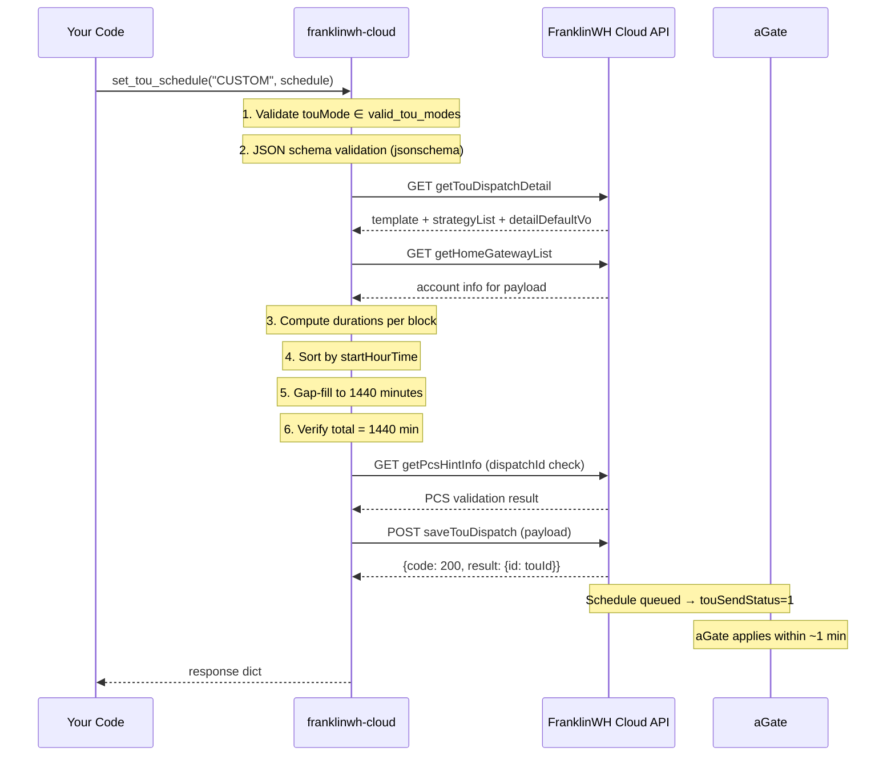
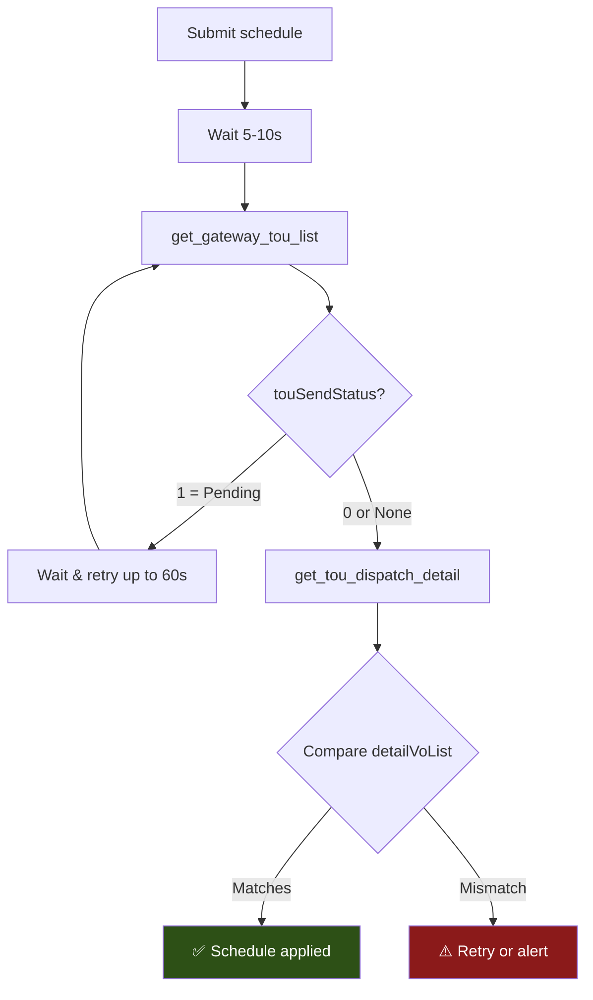
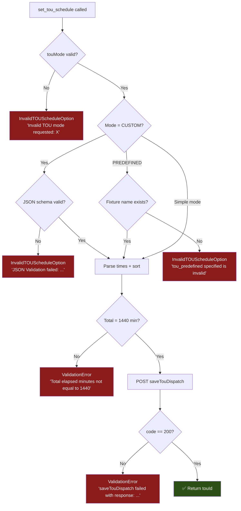

# TOU Schedule API — Read, Write, Verify & Error Handling

> [!CAUTION]
> **Use at your own risk — test extensively before relying on this in production.**
>
> The FranklinWH Cloud API **does not have native "force charge" or "force discharge" commands** with fixed time windows or target SoC parameters. TOU schedule manipulation via `GRID_CHARGE` (dispatchId=8) and `GRID_EXPORT` (dispatchId=7) dispatch codes is the **nearest equivalent** — it tells the aGate to charge/discharge during specific time periods, but behaviour depends on grid conditions, battery state, and firmware.
>
> **Known limitations:**
> - `maxChargeSoc` — accepted by the API but **not verified in all firmware versions**
> - `minDischargeSoc` — **does not work** in recent testing (aGate ignores this field)
> - Not all advanced TOU fields (`gridChargeMax`, `dischargePower`, `rampTime`, etc.) are fully supported or implemented by the aGate firmware
> - For **compatibility with the official FranklinWH mobile app**, keep time periods in **30-minute boundaries** (e.g. 11:30, 12:00, 14:30). Arbitrary times like 11:49 work via the API but may display incorrectly or be overwritten in the app
> - `set_tou_schedule` only supports a single season (all 12 months) and every-day scheduling (no weekday/weekend split)

---

## Dispatch Code Reference

| Code | dispatchId | Enum Name | Battery Behaviour |
|------|-----------|-----------|-------------------|
| `HOME` | `1` | `HOME_LOADS` | aPower → home loads, surplus solar → grid |
| `STANDBY` | `2` | `STANDBY` | Battery idle, solar → home, excess → grid |
| `SOLAR` | `3` | `SOLAR_CHARGE` | Charge battery from solar only |
| `SELF` | `6` | `SELF_CONSUMPTION` | Solar → battery → home, excess → grid |
| `GRID_EXPORT` | `7` | `GRID_EXPORT` | Force discharge battery → grid |
| `GRID_CHARGE` | `8` | `GRID_CHARGE` | Force charge battery from grid + solar |

Wave types (tariff periods): `OFF_PEAK=0`, `MID_PEAK=1`, `ON_PEAK=2`, `SUPER_OFF_PEAK=4`

---

## API Methods

### Reading

| Method | Endpoint | Returns |
|--------|----------|---------|
| `get_tou_dispatch_detail()` | `GET /tou/getTouDispatchDetail` | Full template + strategies + dispatch list |
| `get_gateway_tou_list()` | `POST /tou/getGatewayTouListV2` | TOU config status, send status, alerts |
| `get_tou_info(option)` | _(wraps above)_ | `0`=raw, `1`=current+next, `2`=full detailVoList |
| `get_charge_power_details()` | `GET /chargePowerDetails` | SoC, estimated runtime, consumption |

### Writing

| Method | Endpoint | Purpose |
|--------|----------|---------|
| `set_tou_schedule(touMode, touSchedule)` | → `POST /tou/saveTouDispatch` | Validate + gap-fill + submit schedule |

---

## Schedule Entry Format (detailVoList)

Each time block is a dict with **5 mandatory fields**:

```python
{
    "name":          "Off-Peak",       # Human label (e.g. tariff tier name)
    "startHourTime": "11:49",          # HH:MM (24h)
    "endHourTime":   "14:59",          # HH:MM or "24:00"
    "waveType":      0,                # Tariff tier (0=Off-Peak, 2=On-Peak, etc.)
    "dispatchId":    8                  # Dispatch mode (see table above)
}
```

> [!IMPORTANT]
> The full 24 hours (00:00 → 24:00 = 1440 minutes) must be covered. If your entries have gaps, `set_tou_schedule` auto-fills them using `default_mode` (default: `SELF`) and `default_tariff` (default: `OFF_PEAK`).

Optional fields: `maxChargeSoc`, `minDischargeSoc`, `solarCutoff`, `gridChargeMax`, `gridDischargeMax`, `chargePower`, `dischargePower`, `gridMax`, `gridFeedMax`, `rampTime`, `heatEnable`, `offGrid`, etc.

---

## Flow Diagram — Setting a TOU Schedule



## Flow Diagram — Verification After Submission



---

## Example 1 — Grid Charging 11:49 → 14:59, Self-Consumption Otherwise

### Visual timeline

```
00:00 ─────────────── 11:49 ──────── 14:59 ─────────────── 24:00
│  SELF-CONSUMPTION   │ GRID CHARGE  │  SELF-CONSUMPTION   │
│  (auto-filled gap)  │  (your block)│  (auto-filled gap)  │
│  dispatchId=6       │  dispatchId=8│  dispatchId=6       │
```

### Python code

```python
import asyncio
import logging
from franklinwh_cloud.client import Client, TokenFetcher
from franklinwh_cloud.const import dispatchCodeType, WaveType

logging.basicConfig(level=logging.INFO, format="%(asctime)s %(name)s %(message)s")
logger = logging.getLogger("tou_example")

async def set_grid_charge_window():
    """Set grid charging from 11:49 to 14:59, self-consumption all other times."""
    
    fetcher = TokenFetcher("your@email.com", "your_password")
    await fetcher.get_token()
    client = Client(fetcher, "YOUR-AGATE-SN")

    # ── Step 1: Read current schedule ────────────────────────────
    logger.info("Reading current TOU schedule...")
    current = await client.get_tou_dispatch_detail()
    template = current.get("result", {}).get("template", {})
    logger.info(f"Current tariff: {template.get('name', '?')}")
    
    # Read current status
    tou_status = await client.get_gateway_tou_list()
    send_status = tou_status.get("result", {}).get("touSendStatus", 0)
    if send_status:
        logger.warning("A schedule change is already pending (touSendStatus=1)")

    # ── Step 2: Define the schedule ──────────────────────────────
    # Only define the NON-DEFAULT block.
    # Everything else auto-fills with default_mode="SELF" (dispatchId=6)
    schedule = [
        {
            "name":          "Off-Peak",
            "startHourTime": "11:49",
            "endHourTime":   "14:59",
            "waveType":      WaveType.OFF_PEAK.value,      # 0
            "dispatchId":    dispatchCodeType.GRID_CHARGE.value,  # 8
        }
    ]
    
    # ── Step 3: Submit ───────────────────────────────────────────
    logger.info("Submitting TOU schedule...")
    try:
        result = await client.set_tou_schedule(
            touMode="CUSTOM",
            touSchedule=schedule,
            default_mode="SELF",        # Gap-fill with self-consumption
            default_tariff="OFF_PEAK",  # Gap-fill tariff tier
        )
        
        if result.get("code") == 200:
            tou_id = result["result"]["id"]
            logger.info(f"✅ Schedule submitted — touId={tou_id}")
        else:
            logger.error(f"❌ Unexpected response: {result}")
            return
            
    except Exception as e:
        logger.error(f"❌ Schedule submission failed: {e}")
        return

    # ── Step 4: Verify ───────────────────────────────────────────
    logger.info("Verifying schedule was applied...")
    await asyncio.sleep(5)  # Wait for aGate processing
    
    for attempt in range(6):  # Retry up to 30s
        verify = await client.get_gateway_tou_list()
        status = verify.get("result", {}).get("touSendStatus", 0)
        if not status:
            break
        logger.info(f"  Still pending... (attempt {attempt + 1}/6)")
        await asyncio.sleep(5)
    
    # Read back and confirm
    readback = await client.get_tou_info(2)  # option=2: full detailVoList
    logger.info(f"Schedule has {len(readback)} time blocks:")
    for block in readback:
        disp = block.get("dispatchId", "?")
        logger.info(f"  {block['startHourTime']} → {block['endHourTime']}  "
                     f"dispatch={disp}  wave={block.get('waveType', '?')}")

asyncio.run(set_grid_charge_window())
```

### What `set_tou_schedule` generates (after gap-fill)

The library auto-fills the gaps, producing a **3-block** schedule:

```python
[
    {"startHourTime": "00:00", "endHourTime": "11:49", "dispatchId": 6, "waveType": 0, "name": "Off-Peak"},  # auto-filled
    {"startHourTime": "11:49", "endHourTime": "14:59", "dispatchId": 8, "waveType": 0, "name": "Off-Peak"},  # your block
    {"startHourTime": "14:59", "endHourTime": "24:00", "dispatchId": 6, "waveType": 0, "name": "Off-Peak"},  # auto-filled
]
```

---

## Example 2 — Custom: Self → Grid Export → Home Loads

### Visual timeline

```
00:00 ─────────────── 18:30 ──────── 19:45 ─────────────── 24:00
│  SELF-CONSUMPTION   │ GRID EXPORT  │   HOME LOADS        │
│  dispatchId=6       │  dispatchId=7│  dispatchId=1       │
│  waveType=0 OffPeak │  waveType=2  │  waveType=2 OnPeak  │
```

### Python code

```python
async def set_custom_three_phase_schedule():
    """Self-consumption → Grid export 18:30-19:45 → Home loads after."""
    
    fetcher = TokenFetcher("your@email.com", "your_password")
    await fetcher.get_token()
    client = Client(fetcher, "YOUR-AGATE-SN")

    # Define all 3 blocks explicitly (covers full 24h — no gap-fill needed)
    schedule = [
        {
            "name":          "Off-Peak",
            "startHourTime": "00:00",
            "endHourTime":   "18:30",
            "waveType":      WaveType.OFF_PEAK.value,            # 0
            "dispatchId":    dispatchCodeType.SELF_CONSUMPTION.value,  # 6
        },
        {
            "name":          "On-Peak",
            "startHourTime": "18:30",
            "endHourTime":   "19:45",
            "waveType":      WaveType.ON_PEAK.value,             # 2
            "dispatchId":    dispatchCodeType.GRID_EXPORT.value,  # 7
        },
        {
            "name":          "On-Peak",
            "startHourTime": "19:45",
            "endHourTime":   "24:00",
            "waveType":      WaveType.ON_PEAK.value,             # 2
            "dispatchId":    dispatchCodeType.HOME_LOADS.value,   # 1
        },
    ]

    try:
        result = await client.set_tou_schedule(
            touMode="CUSTOM",
            touSchedule=schedule,
        )
        
        if result.get("code") == 200:
            print(f"✅ touId={result['result']['id']}")
        else:
            print(f"❌ API error: code={result.get('code')} msg={result.get('msg', '?')}")
            
    except InvalidTOUScheduleOption as e:
        # Bad touMode, invalid predefined name, or JSON schema failure
        print(f"❌ Validation error: {e}")
    except ValidationError as e:
        # Schedule doesn't cover 24h, or saveTouDispatch returned non-200
        print(f"❌ Schedule error: {e}")
    except Exception as e:
        print(f"❌ Unexpected error: {type(e).__name__}: {e}")
```

---

## Error Handling Reference



### Exception Types

| Exception | When | Common Cause |
|-----------|------|--------------|
| `InvalidTOUScheduleOption` | Before API call | Bad touMode, invalid predefined name, JSON schema violation |
| `ValidationError` | After gap-fill | Schedule ≠ 1440 min (overlapping/impossible times) |
| `ValidationError` | After API call | `saveTouDispatch` returned non-200 (server rejected payload) |
| `httpx` exceptions | Network | Timeout, DNS, auth token expired |

### Logging

All `set_tou_schedule` operations log to `"franklinwh_cloud"` logger. Enable with:

```python
logging.getLogger("franklinwh_cloud").setLevel(logging.INFO)
# or for full trace:
logging.getLogger("franklinwh_cloud").setLevel(logging.DEBUG)
```

Key log messages to watch for:
- `set_tou_schedule: Inserting missing time period entry at start/end` — gap-fill triggered
- `set_tou_schedule: Amended sorted_data with missing time periods` — gaps were repaired
- `set_tou_schedule: saveTouDispatch successful, touId = X` — success
- `set_tou_schedule: Error: saveTouDispatch failed` — API rejection

---

## CLI Usage

### Reading schedules (available now)

```bash
franklinwh-cli tou                    # Schedule overview with dispatch blocks
franklinwh-cli tou --dispatch         # Include raw dispatch metadata
franklinwh-cli tou --json             # Machine-readable JSON
```

### Setting schedules from CLI

> [!WARNING]
> `tou --set` is **not yet implemented** in the CLI. The `tou` subcommand is read-only.

**Workarounds to set from CLI:**

**Option A** — Use `mode --set` for simple whole-day modes:
```bash
franklinwh-cli mode --set self_consumption
franklinwh-cli mode --set tou
franklinwh-cli mode --set emergency_backup --soc 30
```

**Option B** — Use `raw` for direct API passthrough:
```bash
# Read current schedule
franklinwh-cli raw get_tou_dispatch_detail --json

# Read with option=2 (full detailVoList)
franklinwh-cli raw get_tou_info 2 --json
```

**Option C** — Python one-liner:
```bash
python3 -c "
import asyncio
from franklinwh_cloud.client import Client, TokenFetcher
from franklinwh_cloud.const import dispatchCodeType as D, WaveType as W

async def go():
    f = TokenFetcher('email', 'pass')
    await f.get_token()
    c = Client(f, 'AGATE-SN')
    r = await c.set_tou_schedule('CUSTOM', [
        {'name':'Off-Peak','startHourTime':'11:49','endHourTime':'14:59',
         'waveType':W.OFF_PEAK.value,'dispatchId':D.GRID_CHARGE.value}
    ])
    print(f'touId={r[\"result\"][\"id\"]}' if r['code']==200 else f'ERROR: {r}')

asyncio.run(go())
"
```

### Future CLI Enhancement

A `tou --set` subcommand could accept:
```bash
# Proposed (not yet built):
franklinwh-cli tou --set GRID_CHARGE --start 11:49 --end 14:59
franklinwh-cli tou --set CUSTOM --file schedule.json
```

---

## Key Constraints & Gotchas

| Constraint | Detail |
|-----------|--------|
| **No native force charge/discharge** | Cloud API has no dedicated timed charge/discharge or target-SoC command. TOU dispatch is the nearest equivalent |
| **`minDischargeSoc` broken** | API accepts the field but aGate ignores it in recent testing — does not enforce minimum SoC during discharge |
| **`maxChargeSoc` unverified** | May work on some firmware versions — test before relying on it |
| **Advanced fields unsupported** | `gridChargeMax`, `dischargePower`, `rampTime`, `gridFeedMax`, etc. are accepted but may be ignored by aGate |
| **30-minute boundaries** | For mobile app compatibility, use times like `11:30`, `12:00`, `14:30`. Arbitrary times (e.g. `11:49`) work via API but may render incorrectly in the official app or be overwritten when the user edits the schedule |
| **24h coverage** | Schedule must total exactly 1440 minutes. Gap-fill handles this automatically |
| **Single season only** | `set_tou_schedule` creates one "Season 1" covering all 12 months |
| **Every-day only** | Uses `dayType=3` (every day). No weekday/weekend split |
| **Tariff must be TOU** | May not work if user has "Flat" or "Tiered" rate plans configured |
| **touSendStatus** | After submit, `=1` means pending. May persist as false positive even after applied |
| **String `'null'`** | The code uses the string `'null'` (not Python `None`) in some payload fields — this is intentional for the API |
