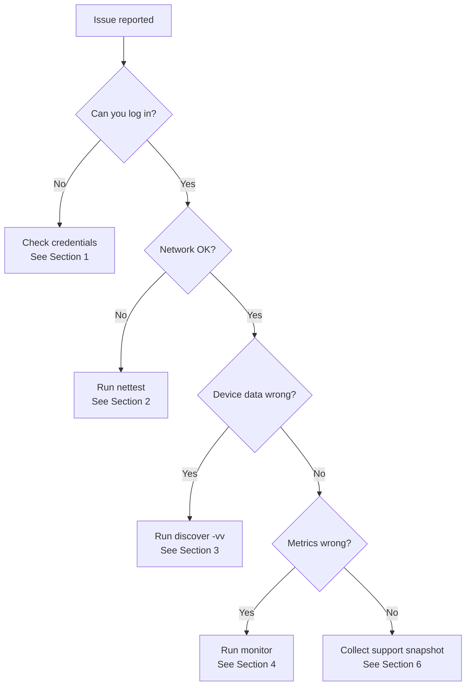
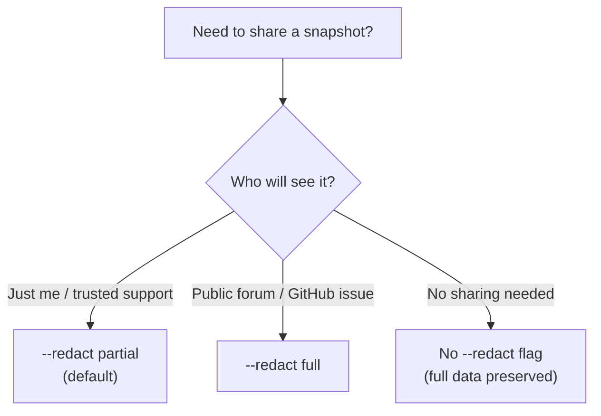

# Troubleshooting Guide

Common issues, diagnostic techniques, and best practices for the FranklinWH Cloud API client.

---

## 1. Login & Authentication Issues

### Symptoms

- `Login failed` or `Invalid credentials` errors
- HTTP 401 / 403 responses
- `select_gateway()` returns empty list

### Checklist

| Check | Details |
|-------|---------|
| ✅ Correct email | Must match your FranklinWH app login exactly |
| ✅ Correct password | Copy-paste to avoid typos — watch for trailing spaces |
| ✅ aGate serial number | Found on the aGate label or in the app under Settings → Device Info |
| ✅ Owner account | **Do not use an installer account** — installer accounts have different permissions and may not expose all API endpoints |
| ✅ Unique password | See security best practices below |

### Security Best Practices

!!! warning "Use a unique password"
    Your FranklinWH account password should be **unique** and not shared with
    any other service. This library stores credentials locally and sends them
    to Franklin's Cloud API — using a reused password increases risk if any
    service is compromised.

**Recommendations:**

- Use a **password manager** (1Password, Bitwarden, etc.) to generate a unique, strong password
- Change your FranklinWH password to something unique before using this library
- Store credentials in `franklinwh.ini` (not in scripts) and ensure the file has restrictive permissions:

```bash
chmod 600 franklinwh.ini
```

- **Never commit** `franklinwh.ini` to version control — it's already in `.gitignore`

### Common Fixes

```python
# Test login in isolation
from franklinwh_cloud import FranklinWHCloud

client = FranklinWHCloud(email="user@example.com", password="my_password")
await client.login()                 # Does this succeed?
gateways = await client.get_home_gateway_list()
print(gateways)                      # Do you see your gateway?
await client.select_gateway()        # Does auto-select work?
print(f"Gateway: {client.gateway}")  # Is this your serial number?
```

If `get_home_gateway_list()` returns data but `select_gateway()` fails, you may have multiple gateways — pass the serial explicitly:

```python
await client.select_gateway("YOUR_AGATE_SERIAL")
```

---

## 2. Network Connectivity Issues

### Symptoms

- API calls timeout or return connection errors
- Intermittent failures under load
- High latency on API responses

### Using the Network Connectivity Test

The CLI includes a built-in network connectivity test (sometimes referred to as "nettest" internally) that probes each hop in the API path:

```bash
# Single connectivity test
franklinwh-cli support --nettest

# Continuous monitoring (every 30s for 10 minutes)
franklinwh-cli support --nettest --interval 30 --duration 600

# JSON output for logging/analysis
franklinwh-cli support --nettest --json
```

**What it tests:**


| Hop | What it checks |
|-----|----------------|
| DNS resolution | Can your machine resolve `energy.franklinwh.com`? |
| CloudFront edge | Which CDN edge are you hitting? (e.g. `SYD62-P1`) |
| API auth | Can you authenticate and get a token? |
| Gateway query | Can the API reach your gateway record? |
| MQTT round-trip | Can the API send/receive from your aGate? |
| FEM (if present) | Can you reach your local FEM instance? |

### Interpreting Results

- **DNS failure** → Check your internet connection, DNS settings, or VPN
- **CloudFront slow (>500ms)** → You may be routing through a distant edge; check VPN/proxy settings
- **API auth slow (>2s)** → Franklin's auth service may be under load; retry later
- **MQTT timeout** → Your aGate may be offline, rebooting, or on a weak cellular/WiFi connection
- **FEM unreachable** → Check that FEM is running and on the same network

### Scheduled Monitoring

For ongoing monitoring, see [SCHEDULING.md](SCHEDULING.md) to set up automated network tests with cron or launchd.

---

## 3. Devices or Configuration Appear Wrong

### Symptoms

- `discover` shows incorrect device models or counts
- Smart circuit names don't match the app
- Configuration values differ from what the app shows
- Missing accessories (aGate, aPower, aPBox)

### Possible Causes

| Cause | How to check |
|-------|-------------|
| **API change** | Franklin may have updated their API schema — check with `-vv` for raw responses |
| **Region difference** | AU vs US systems may return different fields — check `discover --json` |
| **Stale cache** | Some values are cached app-side — try a fresh API call |
| **Bug in parsing** | Open a [bug report](https://github.com/david2069/franklinwh-cloud/issues/new?template=bug_report.yml) with the raw JSON |

### Diagnostic Steps

```bash
# 1. Run verbose discover to see all fields
franklinwh-cli discover -vv

# 2. Compare raw API output with parsed output
franklinwh-cli raw get_agate_info --json
franklinwh-cli raw get_apower_info --json
franklinwh-cli raw get_smart_circuits_info --json

# 3. Full system snapshot for comparison
franklinwh-cli support --save --redact
# Saves: franklinwh_snapshot_YYYYMMDD_HHMMSS_XXXX_redacted.json
```

### Comparing Snapshots

If configuration changed unexpectedly, compare two snapshots:

```bash
# Take a snapshot now
franklinwh-cli support --save --label before

# ... make changes or wait ...

# Compare with the previous snapshot
franklinwh-cli support --compare franklinwh_snapshot_*_before.json
```

The diff output highlights exactly which fields changed and their old → new values.

---

## 4. Metrics Appear Inaccurate or Missing

### Symptoms

- Power values (solar, battery, grid) seem wrong
- Energy totals don't match the FranklinWH app
- Some fields return `null` or `0` unexpectedly

### Important Context

!!! note "Units matter"
    The Cloud API returns power in **kW** (not W). If you see `4.2`, that's
    4.2 kW = 4,200 W. The CLI displays values as-is from the API.

### Troubleshooting Checklist

| Check | Details |
|-------|---------|
| Which metrics? | Specify exactly which values are wrong (e.g. `solar_production`, `grid_power`) |
| When? | During what time of day? What was the system doing? (charging, exporting, idle) |
| Compared to what? | The FranklinWH app? A CT clamp? Your utility meter? |
| Snapshot saved? | Take a snapshot (`franklinwh-cli support --save`) for reference |

### Common Issues

**Battery power sign convention:**
- **Negative** `battery_power` = **charging** (power flowing into battery)
- **Positive** `battery_power` = **discharging** (power flowing out of battery)

**Grid power sign convention:**
- **Positive** `grid_power` = **importing** from grid
- **Negative** `grid_power` = **exporting** to grid

**Daily totals reset at midnight** — if your totals seem low, check the time.

**Missing fields by region:**
Some API fields are only populated for certain regions or firmware versions.
Run `franklinwh-cli discover --json` and check for `null` values.

### Collecting Evidence

```bash
# Real-time monitoring with timestamps
franklinwh-cli monitor --interval 10

# Raw stats for comparison with the app
franklinwh-cli raw get_stats --json

# Historical data for a specific day
franklinwh-cli raw get_power_details 1 "2026-03-24" --json
#                                   ^type: 1=day, 2=week, 3=month, 4=year, 5=lifetime
```

---

## 5. Using the CLI for Inspection & Troubleshooting

The `franklinwh-cli` is your primary diagnostic tool. Here's how to use it effectively.

### Quick Diagnostic Flow



### Verbosity Levels

```bash
franklinwh-cli -v discover      # INFO — key operations logged
franklinwh-cli -vv discover     # DEBUG — API request/response details
franklinwh-cli -vvv discover    # TRACE — full payload dumps
```

### Module-Specific Tracing

```bash
# Trace only TOU operations
franklinwh-cli --trace tou mode --status

# Trace only network/client operations
franklinwh-cli --trace client discover

# Trace everything
franklinwh-cli --trace all discover -vv

# Write debug output to a file
franklinwh-cli --log-file debug.log -vv discover
```

### Key Diagnostic Commands

| Command | Purpose |
|---------|---------|
| `franklinwh-cli discover` | System overview — devices, firmware, features |
| `franklinwh-cli discover -v` | Verbose — adds electrical, grid, warranty |
| `franklinwh-cli discover --json` | Machine-readable full snapshot |
| `franklinwh-cli diag` | Quick system diagnostics |
| `franklinwh-cli monitor` | Live power flow dashboard |
| `franklinwh-cli support --nettest` | Network connectivity probe |
| `franklinwh-cli support --save` | Full system snapshot to file |
| `franklinwh-cli raw <method>` | Call any API method directly |

---

## 6. Collecting Diagnostics for Support

When filing a bug report or seeking help, collect a comprehensive support snapshot:

### Quick Method

```bash
# Collect and save a snapshot (auto-redacted for safe sharing)
franklinwh-cli support --save --redact

# Output: franklinwh_snapshot_20260324_170000_aG2X_redacted.json
```

### What's Collected

The support snapshot includes:

| Section | Contents |
|---------|----------|
| `identity` | Serial (redacted), firmware, model, region |
| `power_flow` | Current solar, battery, grid, home power (kW) |
| `mode` | Operating mode, SoC, run status |
| `tou_schedule` | Active TOU dispatch blocks |
| `devices` | aPower count, smart circuits, relays |
| `network` | WiFi config (SSID redacted), Ethernet, cellular |
| `pcs` | Grid charge/discharge limits |
| `weather` | Storm hedge settings |

### Labelled Snapshots

Use labels to mark snapshots for before/after comparisons:

```bash
franklinwh-cli support --save --label "before_tou_change" --redact
# ... make changes ...
franklinwh-cli support --save --label "after_tou_change" --redact

# Compare the two
franklinwh-cli support --compare franklinwh_snapshot_*_before_tou_change*.json
```

---

## 7. Masking vs Redacting — What's the Difference?

The `--redact` flag supports two modes that handle Personally Identifiable Information (PII) differently.

### What is PII Data?

**Personally Identifiable Information (PII)** is any data that could identify you, your location, or your devices. In the FranklinWH context, this includes:

| PII Type | Example | Why sensitive |
|----------|---------|---------------|
| Email address | `user@example.com` | Links to your FranklinWH account |
| Gateway serial | `1006000123456` | Unique device identifier — could be used to target your system |
| IP address | `192.168.1.100` | Reveals your network topology |
| MAC address | `AA:BB:CC:DD:EE:FF` | Unique hardware identifier |
| WiFi SSID | `MyHomeNetwork` | Identifies your physical location |
| Street address | `123 Solar Street` | Physical location of your installation |

### Partial Redaction (Masking)

**`--redact partial`** (default) — masks the sensitive portion while keeping enough structure for debugging:

```bash
franklinwh-cli support --save --redact          # default = partial
franklinwh-cli support --save --redact partial  # explicit
```

| Field | Original | Masked |
|-------|----------|--------|
| Email | `david@example.com` | `d***d@e***.com` |
| Serial | `1006000123456` | `100600•••3456` |
| IP | `192.168.1.100` | `192.168.•••.•••` |
| MAC | `AA:BB:CC:DD:EE:FF` | `AA:BB:CC:••:••:••` |
| SSID | `MyHomeWiFi` | `My•••••Fi` |

**Use when:** You want to share the snapshot for debugging but still need to see the general structure (e.g. "is this an aGate X-20 or 2.0?" — the serial prefix reveals the model).

### Full Redaction (Removal)

**`--redact full`** — replaces all PII with `[REDACTED]`:

```bash
franklinwh-cli support --save --redact full
```

| Field | Original | Redacted |
|-------|----------|----------|
| Email | `david@example.com` | `[REDACTED]` |
| Serial | `1006000123456` | `[REDACTED]` |
| IP | `192.168.1.100` | `[REDACTED]` |
| MAC | `AA:BB:CC:DD:EE:FF` | `[REDACTED]` |
| SSID | `MyHomeWiFi` | `[REDACTED]` |
| Address | `123 Solar Street` | `[REDACTED]` |

**Use when:** Posting snapshots publicly (GitHub issues, forums) where no PII should be visible.

### Choosing the Right Level



!!! tip "Always redact before sharing"
    Even in private support channels, use at least `--redact partial`. 
    There's no good reason to share unredacted PII when the masked version
    preserves all the diagnostic value.
