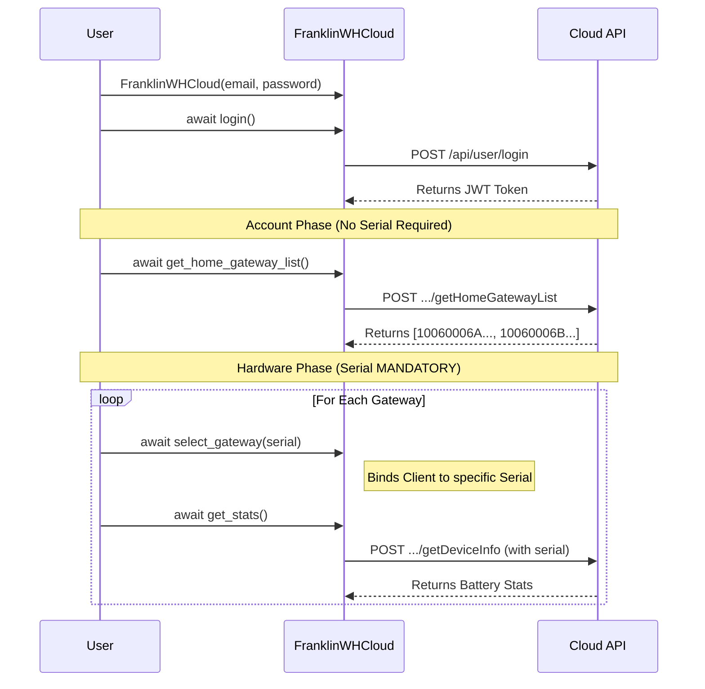

# Getting Started

## Installation

```bash
pip install franklinwh-cloud
```

Or from source:

```bash
git clone https://github.com/david2069/franklinwh-cloud.git
cd franklinwh-cloud
python -m venv venv
source venv/bin/activate
pip install -e .
```

## Configuration

Create `franklinwh.ini` in your project directory:

```ini
[franklinwh]
email = your@email.com
password = your_password
gateway = YOUR-AGATE-SERIAL
```

## Authentication Methods

The `franklinwh-cloud` library supports two distinct initialization architectures.

### Gateway Binding Lifecycle

> [!IMPORTANT]
> **API Serial Number Requirements**
> The FranklinWH Cloud API strictly isolates commands. 
> - **Login:** Requires Email/Password (returns JWT token).
> - **Account APIs:** Requires JWT token (e.g., fetching the list of gateways via `get_home_gateway_list()`). 
> - **Hardware APIs:** Requires JWT token **AND** a specific aGate Serial Number (e.g., fetching telemetry or changing operating modes).



By default, calling `await client.select_gateway()` with NO arguments is a "Happy-Path" convenience method that automatically fetches your gateway list and binds the **first** gateway it finds natively. 
If you manage multiple gateways (multi-site or multi-aGate topologies), **it is your sole responsibility** to fetch `get_home_gateway_list()` and explicitly iterate using `.select_gateway(serial)` before dispatching hardware commands.

### 1. Preferred Method (Legacy Facade)
The simplest way to connect to your aGate. This wrapper handles standard username/password authentication, automatically locates your gateway serial, and binds the connection for you. We strongly recommend using this method for all current scripts and basic automations.

```python
import asyncio
from franklinwh_cloud import FranklinWHCloud

async def main():
    client = FranklinWHCloud("your@email.com", "your_password")
    await client.login()
    await client.select_gateway()
    
    stats = await client.get_stats()
    print(f"Solar: {stats.current.solar_to_house} kW")
    print(f"Battery SoC: {stats.current.battery_pct}%")

asyncio.run(main())
```

### 2. Advanced / Future-Proof Method (Decoupled Client)
The Decoupled Client architecture separates the Authentication Engine from the Core API Dispatcher. 

> **Future-Proofing**: This method should be utilized when the existing legacy authentication method is no longer supported by FranklinWH Cloud API, and new token-based mechanisms (such as API Tokens, OAuth2, or JWT) become mandatory.

*This method is also recommended for long-running services (like Home Assistant) that need to persist naked JWT tokens across reboots without storing plaintext passwords on disk.*

```python
import asyncio
from franklinwh_cloud.client import Client
from franklinwh_cloud.auth import TokenAuth

async def main():
    # Inject a pre-authenticated OAuth/JWT token directly
    fetcher = TokenAuth("jwt_token_string") 
    client = Client(fetcher, "10060006A02F241XXXX")
    
    stats = await client.get_stats()
    print(f"Battery SoC: {stats.current.battery_pct}%")

asyncio.run(main())
```

## CLI Quick Start

```bash
# System overview
franklinwh-cli status

# Live monitoring
franklinwh-cli monitor

# Raw API access (48+ methods)
franklinwh-cli raw list

# JSON output for scripting
franklinwh-cli status --json | jq '.battery_soc'
```

## Prerequisites

- Python 3.12+
- FranklinWH account with aGate access
- Network access to `energy.franklinwh.com`
