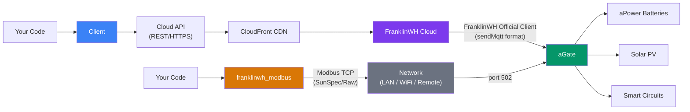

# FranklinWH Cloud

Unofficial Python library and CLI for the **FranklinWH** energy management system.

---

## About This Library

This library provides a Python interface to the **FranklinWH Cloud API** — an undocumented, proprietary service that was designed and optimised exclusively for:

- **FranklinWH Official Mobile App** — available via the [Apple App Store](https://apps.apple.com/app/franklinwh/id1581685498) and [Google Play Store](https://play.google.com/store/apps/details?id=com.franklinwh.app)
- **FranklinWH Energy Website** — an internal platform for authorised FranklinWH employees, contractors, and certified installers and their affiliates

The Cloud API was **not designed for third-party developer use**. It has no public documentation, no official SDK, no versioning guarantees, and no SLA. It may change, be rate-limited, or be discontinued at any time without notice.

### Why This Library Exists

This library was created to enable homeowners and developers to:

- **Monitor** their own FranklinWH energy systems programmatically
- **Understand** the data and control interfaces available
- **Integrate** with home automation platforms (Home Assistant, etc.)
- **Learn** about energy storage system APIs and solar battery management

It fills a gap where no official developer tools exist, allowing FranklinWH system owners to access data about their own equipment.

!!! warning "Important Disclaimer"
    This library is **unofficial** and **not endorsed, supported, or affiliated with FranklinWH** in any way.
    
    It is provided **"AS IS"**, for **educational and informational purposes only**, without warranty of any kind, express or implied, including but not limited to warranties of merchantability or **fitness for any particular purpose**. The author(s) and contributor(s) of this library and its documentation accept **no responsibility or liability** for any consequences of its use, and make **no warranty that it is fit for any purpose**.
    
    **By using this library, you acknowledge that:**
    
    - You are accessing an API not intended for your use
    - The API may change or become unavailable at any time
    - You assume all risk associated with its use
    - You will use this tool responsibly and respect rate limits
    - Excessive or abusive use may impact the service for all users, including official app users

---

## Features

- **Full Cloud API** — 70+ methods across power, modes, TOU, storm, devices, billing
- **CLI tool** — `franklinwh-cli` with rich terminal output and JSON mode
- **Device Discovery** — 3-tier survey with system readiness, feature flags, accessories
- **TOU Schedule Management** — Read, write, verify schedules with gap-fill and validation
- **Tariff Workflow** — Search utilities, browse tariffs, apply templates
- **Network Diagnostics** — WiFi, Ethernet, 4G config via `sendMqtt` REST payloads
- **Billing & Savings** — Electricity data, charge history, benefit tracking
- **[Hardware Quirks](REGION_QUIRKS.md)** — Living registry of region-specific API opacities and AU vs US gaps

## Quick Start

```bash
pip install franklinwh-cloud
```

```python
from franklinwh_cloud.client import Client, TokenFetcher

fetcher = TokenFetcher("your@email.com", "your_password")
await fetcher.get_token()
client = Client(fetcher, "YOUR-AGATE-SN")

# Get current power flows
stats = await client.get_stats()
print(f"Solar: {stats.current.solar_to_house} kW")
```

## CLI

```bash
franklinwh-cli status              # System overview
franklinwh-cli discover -v         # Device survey (3 tiers)
franklinwh-cli monitor             # Live power flows
franklinwh-cli tou                 # TOU schedule
franklinwh-cli raw get_stats       # Raw API passthrough
franklinwh-cli support --nettest   # Network diagnostics
```

## Architecture



> **Two distinct transport paths to the aGate:**
>
> - **Cloud API** — REST calls via CloudFront → FranklinWH Cloud → aGate (`sendMqtt` format). Used by this library and the official FranklinWH app.
> - **Modbus TCP** — Direct LAN connection to aGate port 502. SunSpec-compliant + raw registers. Used by FEM, Home Assistant, and third-party controllers.

!!! abstract "Terminology Disambiguation: `sendMqtt` vs True MQTT"
    Throughout this documentation, you will see references to `sendMqtt` payload wrappers. Please note that the FranklinWH Cloud API executes these commands exclusively over **standard HTTPS REST endpoints** (e.g., `POST /hes-gateway/manage/sendMqtt`).
    
    This library **does not** establish a true, continuous MQTT TCP/WebSocket local connection to the aGate broker. The term `sendMqtt` is merely FranklinWH's internal naming convention for the HTTP-encapsulated JSON wrapper they use to tunnel polling requests from the Cloud down to the physical hardware.

## Documentation

| Section | What's covered |
|---------|---------------|
| [Python Setup](HOWTO_PYTHON.md) | Minimum versions, platform OS setups, and venv creation |
| [Getting Started](getting-started.md) | Installation, credentials, first connection |
| [OpenAPI JSON Spec](franklinwh_openapi.json) | 12,000-line Swagger v3 spec generated from real-world mobile app traffic |
| [API Cookbook](API_COOKBOOK.md) | Copy-paste recipes for common tasks |
| [API Reference](API_REFERENCE.md) | All 70+ methods with parameters |
| [TOU Guide](TOU_SCHEDULE_GUIDE.md) | Schedule management with workflow diagrams |
| [CLI Raw Methods](cli-raw.md) | All raw API methods available from CLI |
| [Troubleshooting](TROUBLESHOOTING.md) | Login, network, metrics, PII redaction guide |
| [Thank You](thank-you.md) | Acknowledgements — Richo and franklinwh-python |
