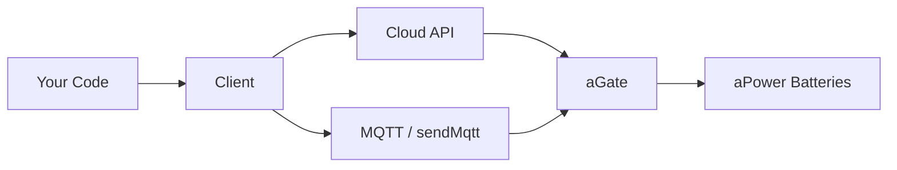

# FranklinWH Cloud

Unofficial Python library and CLI for the **FranklinWH** energy management system.

---

## Features

- **Full Cloud API** — 48+ methods across power, modes, TOU, storm, devices, billing
- **CLI tool** — `franklinwh-cli` with rich terminal output and JSON mode
- **TOU Schedule Management** — Read, write, verify schedules with gap-fill and validation
- **Tariff Workflow** — Search utilities, browse tariffs, apply templates
- **Network Diagnostics** — WiFi, Ethernet, 4G config via MQTT
- **Billing & Savings** — Electricity data, charge history, benefit tracking

## Quick Start

```bash
pip install franklinwh-cloud
```

```python
from franklinwh_cloud.client import Client, TokenFetcher

fetcher = TokenFetcher("your@email.com", "your_password")
await fetcher.get_token()
client = Client(fetcher, "YOUR-AGATE-SN")

# Get current power flows
stats = await client.get_stats()
print(f"Solar: {stats.current.solar_to_house} kW")
```

## CLI

```bash
franklinwh-cli status              # System overview
franklinwh-cli monitor             # Live power flows
franklinwh-cli tou                 # TOU schedule
franklinwh-cli raw get_stats       # Raw API passthrough
franklinwh-cli support --nettest   # Network diagnostics
```

## Architecture



## Documentation

| Section | What's covered |
|---------|---------------|
| [Getting Started](getting-started.md) | Installation, credentials, first connection |
| [API Cookbook](API_COOKBOOK.md) | Copy-paste recipes for common tasks |
| [API Reference](API_REFERENCE.md) | All 48+ methods with parameters |
| [TOU Guide](TOU_SCHEDULE_GUIDE.md) | Schedule management with Mermaid diagrams |
| [CLI Raw Methods](cli-raw.md) | All raw API methods available from CLI |
