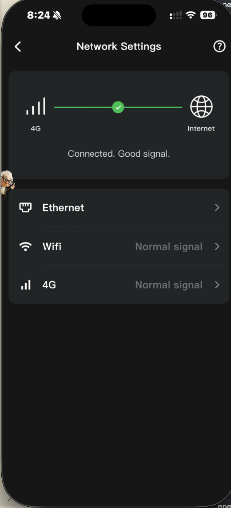
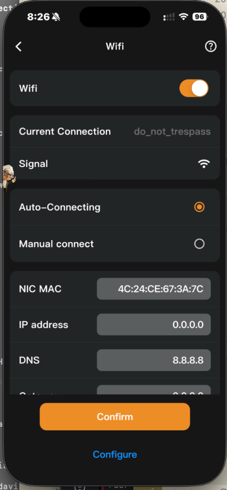
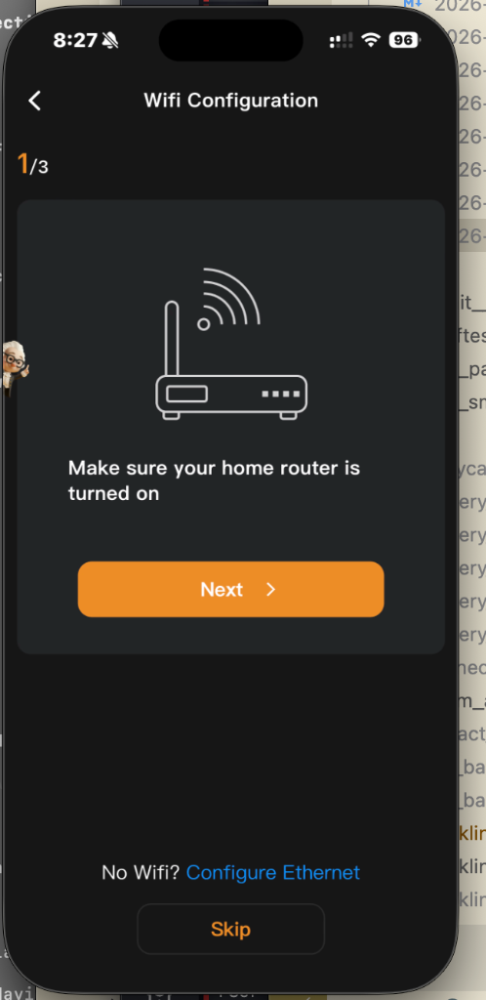
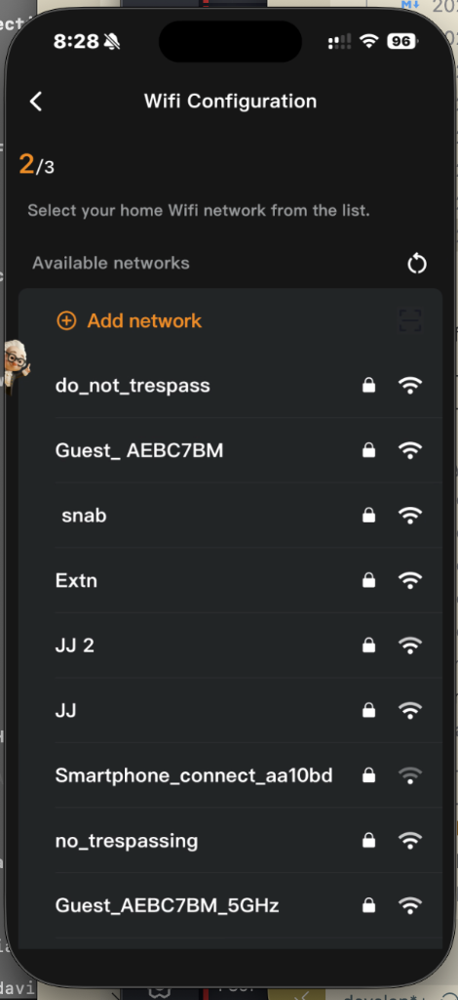
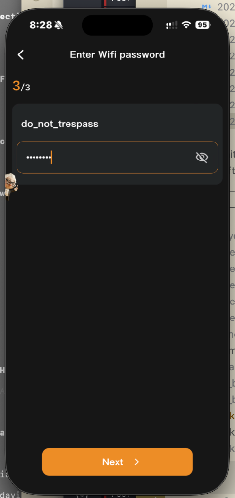
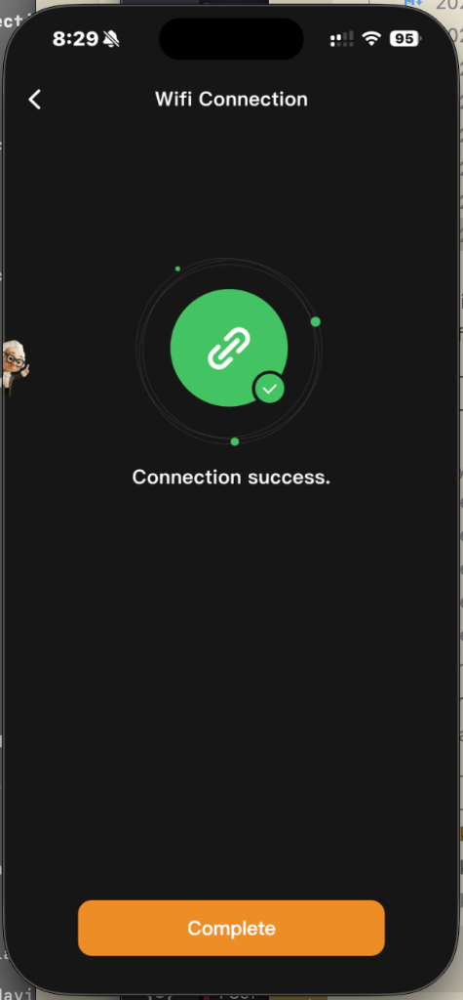
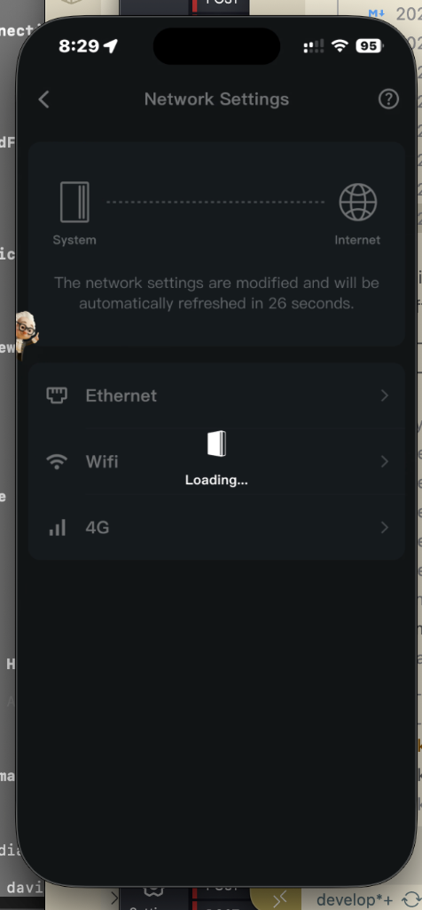
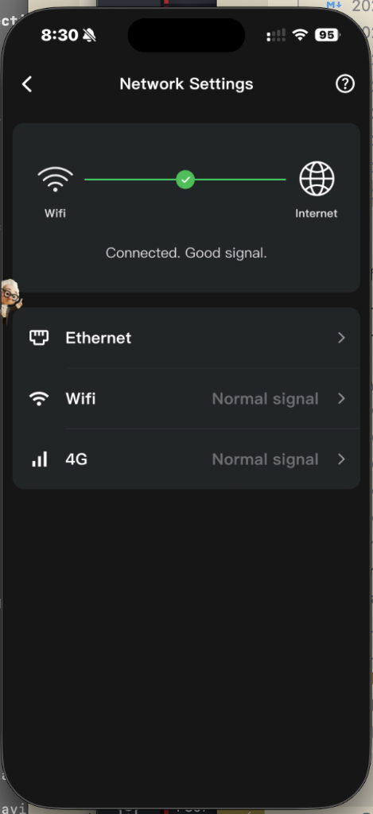

# Network Troubleshooting — 2026-03-21

**Date:** 2026-03-21 08:24–08:30 AEDT
**Device:** FranklinWH aGate X @ 192.168.0.110
**Issue:** aGate WiFi lost DHCP lease, fell back to 4G cellular

## Symptom

CLI Modbus TCP connections failing with "Connection reset by peer" and monitor showing all-zero readings. The aGate was unreachable on the LAN.

## Root Cause

The aGate's WiFi had IP `0.0.0.0` — associated with SSID but no DHCP lease obtained. The aGate fell back to its built-in **4G cellular** modem for cloud connectivity.

### Network Settings — 4G Fallback Active



The connection indicator shows **4G → Internet** (green ✓), confirming the LAN interfaces have failed and the device is on cellular backup.

### WiFi Details — IP 0.0.0.0



- **SSID:** do_not_trespass (connected, normal signal)
- **NIC MAC:** 4C:24:CE:67:3A:7C
- **IP Address:** 0.0.0.0 ← No DHCP lease
- **DNS:** 8.8.8.8

## Resolution

Reconfigured WiFi via the FranklinWH mobile app (WiFi Configuration wizard):

### Step 1–3: WiFi Configuration Wizard





### Step 4: Connection Success



### Step 5–6: Back Online




Connection indicator now shows **WiFi → Internet** (green ✓). The aGate is back on the LAN.

## Verification

Network scan confirmed the aGate is back at `192.168.0.110`:

```
IP Address       Port   Proto    Device Type        Manufacturer     Model        Serial         Version
--------------------------------------------------------------------------------------------------------------
192.168.0.109    1883   MQTT     mqtt_broker        -                MQTT Broker  -              -
192.168.0.110    502    Modbus   modbus_sunspec     FranklinWH Techn aGate X      10060006A02F.. V10R01B04D
192.168.0.17     1883   MQTT     mqtt_broker        -                MQTT Broker  -              -
192.168.0.247    1884   MQTT     mqtt_broker        -                MQTT Broker  -              -
```

## Recommendation

Set a **DHCP reservation** in the router for MAC `4C:24:CE:67:3A:7C` → `192.168.0.110` to prevent this from recurring.
